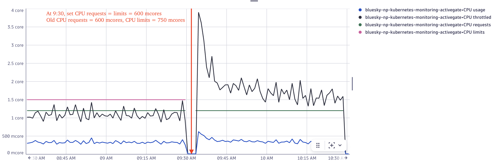
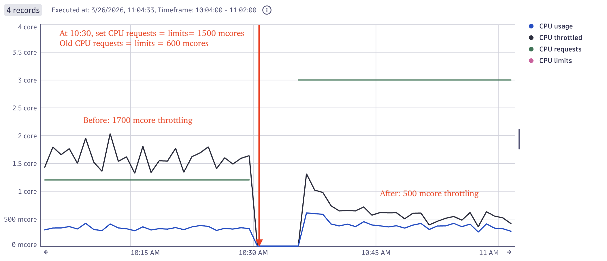
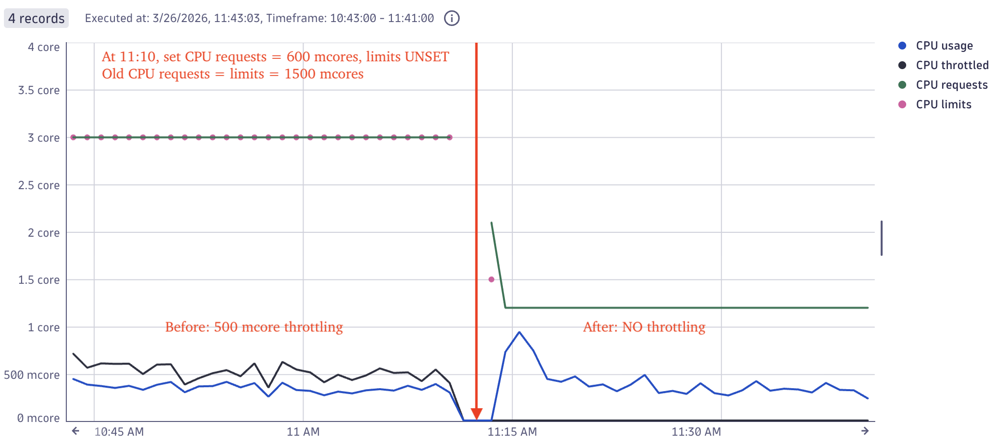
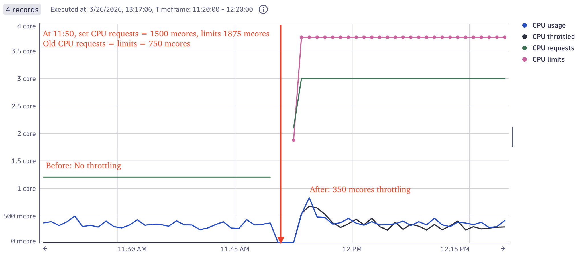

# SREcon 2026 Notes
{: .no_toc}

Author: Evan Brooks

Date: March 24-26, 2026

Contains notes from USENIX SREcon 2026.


# Table of Contents
{: .no_toc}

* TOC
{:toc}

## Overall Takeaways
- If scaling the cluster should always be an option, we should set up an automation to automatically scale up and
down the cluster by one node all the time
- Open a runbook this week and see if it reflects reality. Could someone new on this team open this today and understand it?
- Implement a SPACE metric in each category, Activity is easiest to get started with
- Talk to one of your colleagues. Ask them what do you swear at the most. (Schedule 3 listening sessions 
  [aka coffee with an expert where you ask questions](developerexperiencebook.com], napkin math the cost of one 
  specific friction point)
- Talk to someone from finance. Get an estimate of downtime cost per minute/hour/whatever, and, for bonus points, ask 
  how it is calculated.
- Your measurement doesn't have to mandate change. It just has to make the status quo uncomfortable. 
- Look into Kubernetes operators and common use cases for them
- Limit manual interventions to at most 2 hosts; anything more should be automated. 
- Ask better questions during incident calls. Instead of `Should we try a rollback?`, try this instead: `John, is there any reason we shouldn't try a rollback? If your're okay or I don't hear from you in 3 minutes, I'm going to try a rollback. Jane, can you get Cloud Ops on the line to prepare for the rollback? `
- Look into installing and using [SimKube](https://github.com/acrlabs/simkube) to shift left investigation of EKS upgrade impacts.
- In the incident write-up, always try to tell a story. 

## Fun quotes:
- Any line of code can be load bearing
- "Every hour of downtime costs us $12,000. Friction is adding 8 minutes to every incident. Removing that friction will save us $1,600 per incident."
- Even though we have Terraform modules and it's relatively easy to use them, most developers are not that comfortable with Terraform so we needed something else. - Reddit senior engineer
- "Only a fool learns from his own mistakes. The wise man learns from the mistakes of others." -Otto von Bismarck

## Book recommendations: 
- When do stories work? by Andrew Gelman and Thomas Basboll
- Visual Explanations, by Edward Tufte
- How Complex Systems Fail, by Dr. Richard Cook
- The Art of Business Value, by Mark Schwartz - ideas of problems to solve outpaces the speed of implementation
- From Novice to Expert: Excellence and Power in Clinical Nursing Practice, by Patricia Bennet


## Notes from Tuesday, March 24th

### Keynote
- As software becomes cheaper and easier to build, we will come up with more and more ways to use it. (based on Jevins Paradox)
- How do you respond to failures when people don't understand the depth of the system as well as they used to?
- The curse of knowledge: two-dimension model, x-axis is competence, y-axis is consciousness
  - Bottom: Don't know we don't know (unconsciously confident) = I'm going to make things worse.
  - Middle Bottom: Aware that we don't something = I know I need help.
  - Middle Top: Aware that we DO know something = I know how to fix things that are broken.
  - Top: Unconscious competence: "I know things but I can't explain how") = I have an intuition about might be broken.
- LLMs "hallucination" is when the answer isn't in the source material. Since we ask novel questions in our field, 
  we (engineers) experience more hallucinations than others so the base rate of 2% might feel low to us.
- Prediction: Systems are going to get bigger and more complex, changing at a rate we've never seen before.
- Prediction: We will be moving up the scale of abstraction, thinking less about exactly what went wrong with a 
  database or server, and more about interactions between systems. We need to spend more time reasoning about the
  user experience in various scenarios. "What if X, then the user sees Y"
- Generic mitigations: a series of buttons or levers you can push no matter what is going on (example: 
  turning it off and back on, rolling back to prior version of the software, migrating off broken hardware)
  - These will become more important because we won't immediately know the details of how the systems work when paged
- Good news: experimentation just got a lot cheaper, and we need to do more experimentation as SREs. We need to 
  structure our work as a series of experiments that structure the plan. 
- Test generic mitigations as fitness function (e.g. if your goal is to make sure that rollback is always an option, 
  make sure to automatically test rollbacks all the time)

### Mean time to WTF
- Deployment frequency is increasing due to AI-assisted dev teams, that ship faster
- 10% of deployments, when deployment count is increasing, because a larger number. This increases the friction alongside it.
- DORA metrics to measure pipeline health:
  - Deployment frequency = how often can we deploy code, how often are we responding to incidents
  - Lead time for changes = how long it takes from change merged to deployed and stable (speed is a risk input)
  - Change failure rate = what % of our changes cause incidents
  - Mean time to restore = average time to resolve an incident
- SPACE metrics to measure the whole development lifecycle:
  - Satisfaction - how satisfied are we with the tools, on-call burden, psych safety during incidents
  - Performance - mean time to detect, mean time to restore
  - Activity - toil ratio (?), runbook coverage, automation percentage
  - Communication - incident coordination overhead, how many places do you go to find information, handoff quality
  - Efficiency - tool context-switching, flow interruption, time-to-understand
- Mean time to What the Fork (MTTWTF) - time from incident to "I understand what is going on"
- How to justify the costs to management
  - When talking to developers, talk about "experience", not "productivity"
  - When talking to stakeholders, they will fund "reliability," but not so much "happiness." Anchor proposals to 
    something the business unit _already owns_ (e.g. finance team's downtime cost estimate is a good starting point)
- 

### The Zero Trust Odyssey: Our Journey to Modernize Internal Access

- Goals: reduce three developer access points (VPN, bastion, proxy) to a single one
- Identity aware security: common Okta IdP backed AuthX control plane
- Improved CLI/service access story: simplify machine to machine and CLI authentication without browser login flows.
- Using Cloudflare tunnels to route traffic to the correct EKS cluster (and thus internal EKS load balancer) based on DNS records stored in Route53
- "If you're a human coming from the internal network, your DNS resolves differently" via resolver policies. 
- Humans route to a "cloudflared" tunnel running in the EKS cluster. Scaling with KEDA/HPA on cloudflared_tunnel_concurrent_requests_per_tunnel
- Challenges: Treating Kubernetes clusters as cattle, spinning up and dropping them down automatically
- Authorization is handled by the application layer (womp womp), not the VPN
- Contact information: nathan.handler@reddit.com, [Jobs](https://reddit.jobs)

### Operating Tens of Thousands of GPUs on Hyperscalers: Failure, Firmware, and the Illusion of Capacity
- NVIDIA engineers
- At the scale of Nvidia, a bunch of common assumption are not always true:
    - AWS/GCP/Azure APIs aren't always up
    - Upgrading a node (server) doesn't always work
    - A given storage or network connection throughput is not always given, even if that is what you paid for
- "Weak signals" - the metrics you get from a cloud provider are not a 100% accurate representation of the state of the system,
  and you don't always have the information needed.
  - Keep your own records, don't blindly trust the cloud provider's metrics.
- "kernel log link flap" lol this talk is so jargon heavy
- Nominal capacity (what is promised by the cloud provider) does not necessarily equal what you ACTUALLY get under load
- "I personally have more than one 15,000 host groups" oh my lord
- It is more expensive to disrupt workloads than it is to maintain a certain amount of capacity overhead on nodes

### STPA for Software Systems - Illuminate the Unknown Unknown
- Goals: describe STPA, use it in practice to predict incidents with it
- STPA is a system to methodically predict where incidents might occur in a system at the _design stage_
- Background: most failure modes are introduced during the design of the product, but they are detected in testing and production
- STPA = "Systems Theoretic Process Analysis", four official steps:
    1. Scope the analysis - define the losses that stakeholders try avoid and unsafe system states that could lead to those losses
    2. Model the system - modelling behavior and control
    3. List unsafe control actions - identify unsafe control actions that could lead to unsafe states
    4. Build loss scenarios - explain how the unsafe control actions could actually lead to the losses
    5. (Unofficial Engineering phase) Mitigations - engineer the solutions to address these scenarios
- Pen and paper method to analyze behavior of a system, and see all the ways that your system can have a loss; it's like having a flashlight and being told where to point to illuminate the unknown unknowns

Example "losses":
- Loss of revenue
- Loss of brand trust
- Loss of legal compliance
- Injury or loss of life

> Losses should not reference low level details or causes. They should derive from business processes or values, not technical details. 
> For example, "loss of revenue" is a good loss, but "database outage" is not a good loss.

Example "hazards" (hazard = a system state that will lead to a loss under worst case environmental conditions):
- Production service is returning errors
- Production service is responding slowly

Basic control feedback loop process line diagram:
```
Controller -> Control Action -> Process -> Feedback -> Controller
```

Google finds that developers are good at determining control actions, but don't do a good job of identifying feedback mechanisms 
(low fidelity or none at all), which is where a lot of the unknown unknowns are.

> UCA = Unsafe Control Action is a control action that could lead to a hazard in specific contexts.
For example, "turning on the database" is a control action. If it is done at the wrong time, it could lead to a hazard (e.g. if the database is already overloaded).

Example UCAs:
1. Roll back to previous version when the production service is NOT returning errors
2. Roll back to previous version if the prior version is no longer compatible with production (db schema change)

All possible UCAs fall into the following categories:
- Roll back when X (take a action)
- Not roll back when X (don't take an action)
- Roll back before/after X (timing of action)
- Roll back stopped too soon/applied too long X (timing of action)

Step 4: goal is a comprehensive list of the ways a UCA can happen, leading to hazard states and lossses.
"Safe feedback" vs "Unsafe feedback"

Safe feedback leading question:
- Why would the production service NOT be rolled back in spite of feedback existing that shows server errors?

Specific questions you can ask to help system controllers:
- Who makes the decision to roll back?
- How does the SRE decide whether to roll back?
- What dashboards/signals/etc. do you look at?
- Does anyone ever order the SRE to do a rollback?

Unsafe feedback is feedback that is wrong, delayed, incomplete, or missing. Unsae feedback leading question:
- Why would the feedback NOT indicate that the service is returning errors, even though it is?

Control path scenario questions for UCA: SRE does not roll bcak to previous version when production service is returning errors. Example:
> How can you explain that the SRE initiates a roll bcak, but the roll bcak doesn't reach production?

Controlled process scenario question:
> Why would the rollback reach the production service, but the production service isn't rolled back to a previous version?

Software is built in the happy path. Software engineers are optimists, and SREs are pessimists.
STPA is way more popular in the design stage of the application. 

Key takeaways: 
- STPA finds and fixes deisgn problems at a fraciton of the cost
- STPA enables a systemic exploration of unsafe system behavior

## Notes from Wednesday, March 25th

### Escaping Version Skew: Formalizing compatibility in a world of partial rollouts

- Adding time dimension to your deployments makes them hard to reason about
- Systems we make most often break when they change
- Don't rely on humans to catch breaking changes cause by rollout order
- protobufs solve some of the problems of version skew, but limit the types of changes you can make. Your code shouldn't have to handle "all versions for all time" 
- The stricter a schema is, the easier it is to make a breaking change, and our current tooling creates what he calls "optional slop." Optional slop reduces the usefulness of the typing, making "impossible states" possible. Example:
mutually incompatible fields in a protobuf schema, but they are both optional, so you can have a state where both fields are set, which SHOULD be an impossible state and prevented by the types.
- agentic worklflows get safer with stricter contracts, because they:
  - declare a smaller legal state space and
  - makes assumptions explicit
- Claim: we can make this better by stopping sharing types between client and servers.
  - Writers provide a strict schema that only declares the CURRENT version of what is being sent
  - Readers should accept the union of the prior few valid schemes
- To implement this, since no one wants to write the consumer to branch on the different types, we should generate code from the schema. Process:
1. Update the write schema strictly.
2. CI detects breaking changes.
3. Generate writer type as strictly as possible.
4. Generate reader types as a union of the last few writers.
5. Measure how often old writer branches still deserialize.
6. Delete old branches once metrics hit zero.

- Introducing jsoncompat: statically analyzes JSON schema changes to determine whether they are breaking, with a fallback on a fuzzer to generate a concrete counterexample when static analysis is hard
  - L~new~ is subset of L~old~ = new writer safe for old reader
  - L~old~ is subset of L~old~  = old writer safe for new reader
- JSON schema's usage of things like if-then makes static checking very difficult or impossible
- At OpenAI, tests in certain parts of our codebase fail if the type is not annotated to force type checking
- Where is the worth it are boundaries where state outlives binary: caches, queues, databases

### So You Want a New Incident Commander — Lessons from Building Incident Response Teams

- Used to be the only one leading incident calls and running post mortems at my company
- "I was the single point of failure"
- Most teams already have teams that can be great incident commanders, we may not have recognized them yet
- An incident starts as a technical failure, but it won't stay purely technical. Quickly, it will become an 
  organizational event. You'll have engineers proposing strategies, leaders asking for updates, and customer-facing
  employees asking for what to say to customers. 
- Sociotechnical role: humans interacting with a complex system under pressure
- Instrument command is more like conducting an orchestra than it is about being the boss
- The real job is in three parts
    - For the people: helping them focus & avoid duplicate work, ensuring communication, discussing decisions
    - For the system: creating a shared understanding of the system as technical employees unearth details
    - For the business: knowing what matters to your organization and communicating impacts, actions taken, etc.
- Anti-patterns selecting an incident manager
    - the strongest engineer: don't remove your best investigator from the investigation
    - anyone on call: they may not have the skills
    - most senior person: two problems: people are scared of the most senior manager and most senior people have lots of strong opinions, risking them DICTATING technical and organizational solutions
- Evidence to justify the cost of buiding an incident response team:
    - Combine concrete incident stories with data to justify
    - Data to consider:
        - Cost of uncoordinated events: "14 engineers just sat on a call for 4 hours. that's a lot of time."
        - Before/after incident command
    - Start small and prove the value incident command brings: train a single person and see how it goes
- Options for structure:
    - (her favorite) Deliberate IC team: has explicit responsibility over incidents, they have dedicatedtraining and builds up a lot of experience in those running incidents
    - Incident Commander per domain team: good for groups with strong ownership boundaries, but challenges including inconsistent training and delays moving across technical domains ("how many incidents really only demand the involvement of one segment?")
    - (doesn't love this) IC volunter team: spreads skills, but it can be stressful for the volunteers
- Regardless of the structure, your ICs need to know this is a priority and part of their jobs. It can't just be "one more thing" on their plate.
- Core competencies of IC:
    - Communication
    - Socio-technical leadership
    - Cognitive load
- People who are good at this are "good with people," good with working with ambiguity or with partial information, and good at communicating complex topics at multiple levels of abstraction
- Incidents are not technical failures, they are sociotechnical events. The politics matter as much ast the technical status.

### Epistemology of Incidents and Problem Solving
- Epistemology:
    - How do we find truth in an incident?
    - How can we be certain it's the truth?
    - How can we level up our communication and teammates in the process?
- If you don't write something down so that the process can survive a transition in teams, then you aren't going to react well over time
- Culture of collaboration is a critical ingredient of incident response:
    - "In my opinion, it is a tragedy when an incident is worked alone."
    - "It sucks to page someone else at three AM. It sucks more to decision make alone."
- Phase 1: Survive and Triage. First goal is to keep the boat afloat. Example actions to "buy time in reversible ways":
    - Rollback
    - Scale-up
    - Circuit breakers
    - Access denial
- Phase 2: Examination.
    - Think in systems and chunks
    - Look at the gaps in information and glean meaning from inconsistencies in reported information. 
    - Keep great personal notes. Note taking format:
        - Evidence of the problem: signals that are abnormal
        - Correlated/causal: as I explore, what's related or might be linked
        - Normal: what is normal about the system right now; what looks fine
        - Odd but uncorrelated: computers are weird, "I don't think this is part of the issue," likely to be handled in post mortem if at all
- Phase 3: Diagnosis/Hypothesis
    - Come up with a consistent testable thesis about what is wrong, and execute the experiment.
    - Search patterns: 
        - Linear search (follow the traffic from Edge, to Auth, to Load balancer, to server, to database)
        - Binary search/bisect: check a point in the middle of the flow, tells you whether the issue is upstream of downtime
    - Think in proximity and correlation. 
        - What has happened _recently_ (in time) or _nearby_ (in deployment space)?
        - What _actions_ have been taken?
    - When there is only one hypothesis available at once, you will only be executing on one thing at a time.
    - What makes a good hypothesis?
        - A hypothesis must be testable and relevant and specific to the shape of the current issue.
- Phase 4: Test & Treat the issue
    - A test must work on a specific hypothesis to clearly determine what information you're going to gain from the test.
    - The test should favor the "likely reason" over the unlikely and favor the "fast to verify" over the slow, and avoid as many side effects as possible.
    - Test outcomes should be tracked in your mind and notes, and used to update your hypothesis to create another test.
    - Be proactive: While you are waiting for a test to execute, imagine that your test succeeds, what do you do next? Imagine that the test fails, what do you do next? You can even draft the next coms statement for each of those outcomes while you wait.

- Grab bag of incident communication skills
    - Throw each action taken into Teams or Zoom chat to specify where we spent our time. 
    - Make plans with momentum
    - Ask questions in ways that drive answers, not silence.

**Examples:**
> Bad example: Should we try a rollback?
> Improved version: John, is there any reason we shouldn't try a rollback? If your're okay or I don't hear from you in 3 minutes, I'm going to try a rollback. Jane, can you get Cloud Ops on the line to prepare for the rollback? 


> Bad: "Are we good to scale up?"
> Better: "What are the downsides to scale up?"
> Bad: "Does anyone have any questions?"
> Better: "What can I clarify for you?"

### Stop Reading Changelogs: Safer Kubernetes Upgrades with [Simulation](https://github.com/acrlabs/simkube)

- Reddit pi day upgrade (314 minutes long) was the result of a Kubernetes upgrade from 1.23 to 1.24.
- Talk hosted by drmorr. Grumpy red robot is him, completed PHD in Computer Science in 2014 at UIUC. Worked at Yelp and AirBnb before founding Advanced Computing Research Labs, which does research and development on scaling.
- Why are Kubernetes upgrades hard?
    - Release cycle is 14 weeks long (thrice per year, hard to keep up with)
    - Kubernetes is a series of n independent control loops in a correct-but-unknown order
    - Lots of discussions about in place upgrades vs lift and shift upgrades
    - There IS NO ROLLBACK plan. You literally cannot go backwards. You can either restore from a backup in a new cluster or tried to fix forward.
    - Replicating your production environment is impossible, so test clusters are always going to miss things.
- What's a typical upgrade process?
    1. Someone tells you you need to upgrade (probably one of the Cloud Providers, AWS, GCP, etc.)
    2. Read the changelogs of every component in your cluster
    3. Play whack a mole with issues in a test cluster
    4. Upgrade in prod
    4. Whoops, missed an issue. Hope you got paged before the business unit did.
- Introducing: [SimKube](https://github.com/acrlabs/simkube), a better way to test Kubernetes upgraes
    - How it works
        - Record the YAML files over time, via a tracer
        - Replay the YAML files over time in a simulation cluster
        - Use "KWOK" (Kubernetes without Kubelet) to walk nodes, pods, stateful sets, etc. through their lifecycles without needing hardware backing them up
    - How to use it: SimKube CI Action
    - Right now, we have a free AMI on the AWS marketplace that comes with the SimKube stuff preinstalled. 
- How can SimKube help with upgrades?'
    - Provisioning a simulation environemtn is "free." (no hardware, no cost to run scale tests)
    - Replicating your production environment is impossible, but simulating can shift your upgrade process left (to your laptop)
- Some known limitations:
    - Networking is "right out"
    - Anything that relies on metrics isn't supported (yet, goal is to have this in next six months) [e.g. HPA, KEDA]
    - Interactions with cloud providers gets tricky


### Precision Over Proliferation: SRE Approach for Leaner, Smarter and Data-Driven Observability
- Compute dollar per query for monitoring queries
- Compute cardinality and dollar per query
- Index metrics to their value to make sure that teams don't ignore old metrics that still cost a lot of money

### Observability for LLMs: Understanding What’s Happening Under the Hood
_Speaker: Salman Munaf, TikTok_

- The key mental model for LLMs is to observe the entire interaction and not just the REST API endpoint since a 200 response doesn't necessarily mean the LLM is doing what you want it to do or not lying in the response.
- LLM observability = classical observability + AI observability
    - Classic signals include latency, errors
    - AI workflow signals include model calls, tokens, cost, retrieval, tools, grouding, quality, user feedback
- "just because your LLM endpoint returned 200 OK, it doesn't mean it was a useful response."
- "Time to first token response" has a higher impact than overall response time since most LLM UIs stream the response as it is generated to the user.

Signals they added:
- Token usage
- Time to first token
- Retrieval behavior, example signals:
    - retrieval latency
    - empty retrieval rate
    - retrieved docs count
- Tool success, example signals:
    - tool call count
    - tool success rate
    - tool latency
- Finish reason
- Quality signals (?)

Things to avoid logging for sensitivy reasons:
- raw prompts
- raw completions
- sensitive user data
- broad always-on capture

## Notes from Thursday, March 26th

### 5 Wrong Hypotheses about PostgreSQL Multi-Transaction Locks
_Clint Byrum, HashiCorp, an IBM Company_

- global learning vs local learning
- While you are doing site reliability engineering, you need to be doing some "site reliability engineering science."
- PostgreSQL multi transaction locks: make sure that concurrent transactions do not simultaneously edit a single row
- an index made a query faster, briefly
    - after index created, query latency improved for about 20 minutes
    - T+30m: query lantency spikes like crazy, way worse than the original value
- Expensive experiments when you are already over your error budget are a bad idea
- Take a picture of the graph and put it somewhere where it _won't die_
- And if you don't understand what happened, spend some time writing down at least your questions and hypothesis
- Your error budget drives what kind of experimentation you can do. If you have a surplus, and have an experiment you think is valuable, don't be afraid to spend the surplus budget.

### Intelligent Load Balancing in Kubernetes
_Gaurav Nanda and Vincent Cheng, Databricks_

- Migrating from default Kuberenetes load balancer to something custom to our requirements
- Started with intermittent 5XX errors and high P99 latency, happening across the board for various products at Databricks
- First instinct is to add more CPU, memory, and pods to affected workloads, but this leads to over-provisioned services
- Despite overprovisioned workloads, we still had issues
- We saw that traffic to specific pods was not evenly distributed (in some cases as wrong as 4x more traffic to one pod to another)
- Kubernetes load balancing happens at the level of _connections_, not _requests_
    - Result: Depending on the shape, size and workload of a client, the amount of traffic per connection can vary widely. 
    - This is made worse since only new connections will be balanced to the new pod when scaling occurs.
- Options to remediate:
    - Manually reset all connections every X requests or every Y time
    - Client side load balancing via DNS
    - Use istio-proxy control plane
- Built a custom load balancer, started with a naive round-robin approach, but it had issues:
    - Naive round-robin routing discovered that new pods had a cold start error that was previously hidden by
      the durable connections. Clients were now discovering pods "too early"
    - Found some pods had higher error rates or latency than others
- "Wait, do we want equal distribution? No, we want to get the best _experience_"
- Tried a few ways to bias:
    - Bias away from pods with higher CPU usage, CPU was a mismatch from what we _wanted_ to measure

### Reliability Equilibrium: The Hidden Playbook behind SRE Influence
_Daria Barteneva, Microsoft Azure_

> Your system isn't broken. You're system is doing exactly what it was designed to do. But you can redesign your game.

- Popular discussion group topics: noise reductios, dealng with legacy work, how to get teams to commit to reliability work - same as 8 years ago
- game theory studies situations where outcome depends on other people's choices
- A Nash equilibrium is where everyone is doing the best thing for themselves, and no one can improve by changing alone. This means the system is stable, but not necessarily good.
- SRE's job is to change the game so that the good outcome _becomes the rational one_
- Game theory primer:
    - Players: decision makers
    - Strategies: actions each player can choose
    - Payoffs: what each player gets from an outcome
    - Outcome: result of all strategies selected
- Don't tell people to try harder, change payoffs so that reliability is the rational thing
    - Make shortcuts stop paying off
    - Make system state claer so everyone has clear information
- Freezes become dominant when rollbacks are hard and blame is common. Step to getting a freeze:
    1. Locally rational behavior to deploy often causes global harms of incidents
    2. This leads to a freeze being declared globally
    3. Freezes become synonymous with safety
- Solutions to solve information asymmetry:
    - Shared on-call rotations
    - Blameless post incident reviews
    - Transparent reliability metrics
- How can we get out of the "freeze" equilibrium:
    - Making shipping cheap
        - Canary + progressive delivery
        - Fast rollback & reversibility
        - Early SLIs tied to user experience
    - Make freezing expensive
        - Risk accumulates as unreleased fixes
        - Bigger batch → bigger blast radius later
- Stag-hare hunt equilibrium describes the risk of making big bets alone. If you make a big bet, but don't have the support of their peers, they get 0 rewards.
- Free rider problems in SRE: on-call improvements, building docs and runbooks, platform hardening, reducing alert fatigue
    - In these scenarios, everyone rationally does nothing even though everyone would benefit if someone did something, since there is minimal individual incentive to make a change.
- Stackelberg Leadership: one player or team commits publicly, others best-respond. Power is not derived from their authority, but their commitment. _First commit, then coordinate._ Ways for SRE to be the first mover:
    - Create SLOs and error budgets
    - Improvement deployment processes
- How to fix incident response:
    - Reward prevention, not recovery
    - Fund automation like product work
    - Rotate and share operational burden
- What we should measure to make the issue visible:
    - Time to detect
    - Time to mitigate
    - Toil hours per incident
- How to make retros stick:
    - Make liearning visible in the system (actions in system)
    - Track fix completion rate
    - Measure repeat-incident rate
    - Measure for improvement, not for punishment

Design:
1. Make risk legible by modelling the risks of your systems, creating metrics everyone understands
2. Make decisions collective
3. SRE makes the first move

Summary: persistent reliability problems are structural, not personal problems.

Summary of four failure modes:


- For larger teams with long-lived systems, focs on public goods problems, bayesian game problems, and evolutionary game problems.

### The Power of Stories
_Lorin Hochstein, Airbnb_

- Why should we care about stories?
    - Stories _make sense of the senseless events_ that have happened to us
    - Stories are _memorable_

> The grand challenge of software engineering is how to get the right information into 
> the heads of the people who need.

> Only a fool learns from his own mistakes. The wise man learns from the mistakes of others
> _Otto von Bismarck_

Ways to learn:
- personal experiences
- witness expertise in action
- internalize the lived experience of others

Good stories:
- need to be anomalous from our expectations
- need to have important details preserved

Different kinds of incident stories you can tell:
- Horror stories: "And then, after we failed over... the problem followed us into the other region! 😱"
- Mystery stories: "...But nothing had changed!"
- Morality tales (Lorin doesn't like these): "And because the failing test was ignored, the bad code made it to production. 😒"

Antidote to morality tales are "second stories," retold when more details have come to light and the pressure has decreased. 

## Workpad

### [Throttling testing from 03/20/2026](https://esd41354.apps.dynatrace.com/ui/apps/dynatrace.kubernetes/smartscape/workload/K8S_STATEFULSET?perspective=Utilization&sort=healthIndicators%3Adescending&detailsId=K8S_STATEFULSET-2C823534C4234916&sidebarOpen=false&detailsTab=Utilization&tf=2026-03-20T15%3A00Z%3B2026-03-20T21%3A00Z#filtering=Workload+%3D+bluesky-np-kubernetes-monitoring-activegate+)

- requests = 1500 mcores, Limits = 6000 mcores
    - result: no throttling
- requests = 600 mcores, limits = 6000 mcores
    - result: no throttling
- requests = 600 mcores, limits = 750 mcores
    - result: 1000 to 2000 mcores throttling

### Follow up scenarios to test on 3/25/2026

- Set CPU requests = limits = 600 mcores
    - Predicted outcome: ~1 to 2 cores of CPU throttling, average utilization is LESS than 600m
    - Reasoning: 600m limits is way too little. System will use as much as it can, but get throttled early in each 100 ms period. This reduces the average utilization. 
    - Outcome: 



- Set CPU requests = limits = 1500 mcores
    - Predicted outcome: Less than 1.5 cores of CPU throttling, average utilization is greater than prior experiment, but still a bit less than 1500 mcores (though it is closer as a percentage)
    - Reasoning: 1500m is better, but still not enough for the process. System will use as much as it can, but ultimately still get throttled later in the 100 ms period. This reduces the (weighted) average utilization by a bit, but not a huge amount. 
    - Outcome:




- Set CPU requests = 600 mcores, no limits
    - Predicted outcome: No throttling, accurate CPU usage
    - Reasoning: There is no CPU pressure on the node overall, so the "no limits" means that our container will take as much as it needs and EKS will allow that. 
    - Outcome:



- Set CPU requests = 1500 mcores, CPU limits = 125% x requests = 1875 mcores
    - Predicated outcome: Very similar amount of throttling to 1500 mcores scenario, perhaps a bit less
    - Reasoning: 1875 mcores is still not enough for the process, so we will still get throttled, but it should be a bit less than the 1500 mcores scenario.
    - Outcome:



### To dos after I'm back on work laptop
- Work on deployment with Viswa at 10 pm central time (8 pm pacific)
- 