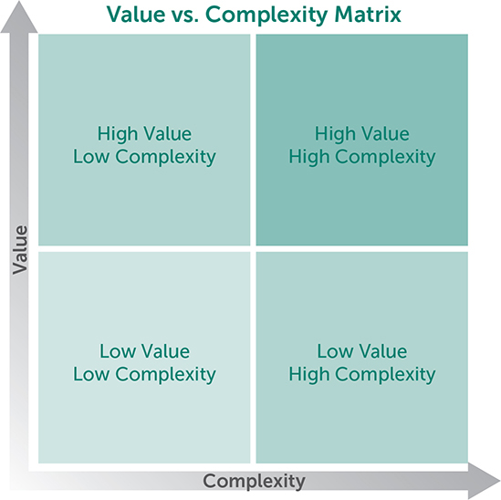
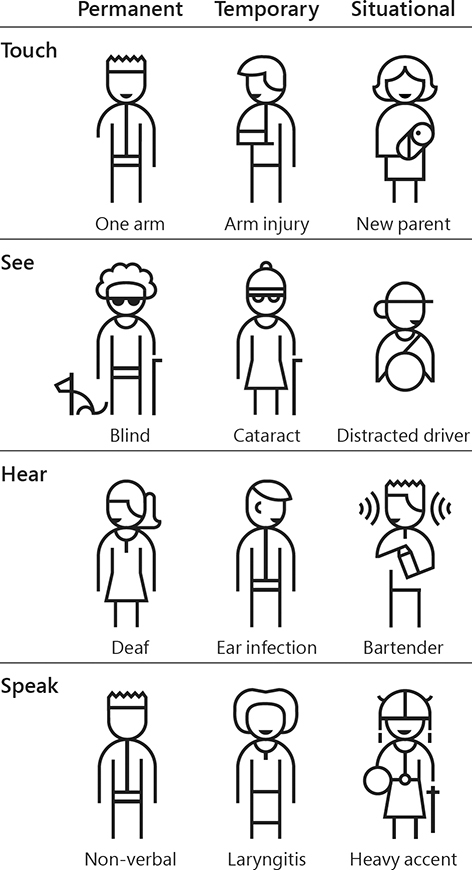
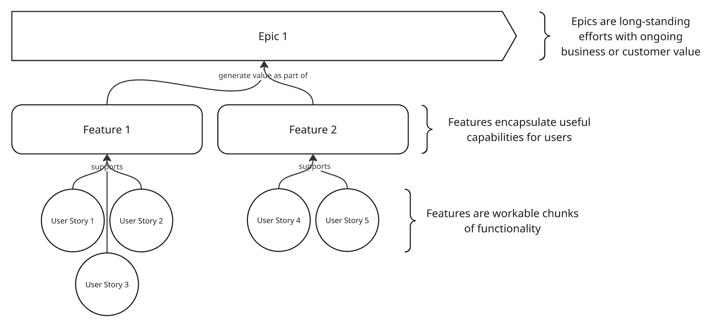
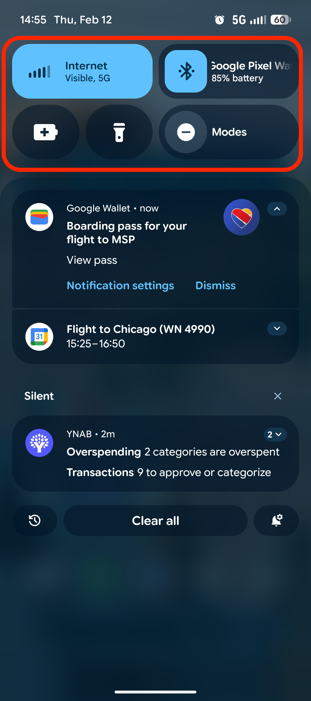
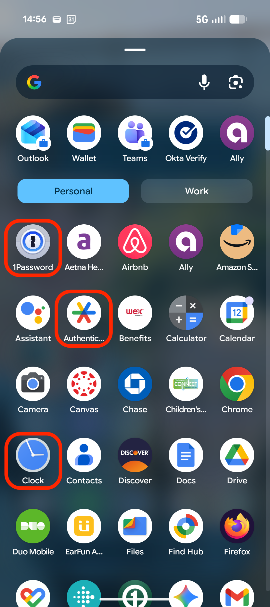

# Outline for Chapters 10-11 of A Project Guide to UX Design
{: .no_toc}

Outline author: Evan Brooks

Outline date: Feb 12th, 2026

# Table of Contents
{: .no_toc}

* TOC
{:toc}

# Essential Questions:

## 1. Why is product definition important?

Product definition is important because it is the process of converging the various ideas presented thus far into a prioritized list of features to build.
The [book mentions the following outcomes](https://learning.oreilly.com/library/view/a-project-guide/9780138188283/ch10.xhtml#ch10lev1sec1:~:text=Give%20structure%20to,focus%20their%20efforts.):
- Structure to the ideas generated in the previous stages
- Estimates of effort and prioritization of features
- A selection of ideas to move forward to product design

## 2. What does Carolyn Chandler mean by defining ideas at "different levels"?

In the context of product ideas, "different levels" refers to the different levels of abstraction at which ideas can be defined.

For example, a high level of abstractio idea is: 
> [Passengers can change or upgrade their assigned seat before purchasing the ticket.](https://learning.oreilly.com/library/view/a-project-guide/9780138188283/ch10.xhtml#ch10lev1sec1:~:text=Passengers%20can%20change%20or%20upgrade%20their%20assigned%20seat%20before%20purchasing%20the%20ticket.)

By contrast, a low level of abstraction idea is:
> [Passengers can select an available seat from the seat map and see an updated cost.](https://learning.oreilly.com/library/view/a-project-guide/9780138188283/ch10.xhtml#ch10lev1sec1:~:text=Passengers%20can%20select%20an%20available%20seat%20from%20the%20seat%20map%20and%20see%20an%20updated%20cost.)

The lower the level of abstraction, the more an idea gets into the "how" of the product, which is important for the next stage of product design.

## 3. What is the format of a user story?

The user story format is nice and simple, and is as follows:

> As a [user role]
> 
> I want to [action]
> 
> so I can [goal]

And example user story provided in the book is:

> As a passenger
> 
> I want to change my seat assignment
> 
> So I can sit closer to the front of the plane.

## 4. How are features and epics related to user stories?

Features are collections of related user stories, and epics are collections of related features.

More precisely, features are ["a distinct piece of functionality with a benefit to the user"](https://learning.oreilly.com/library/view/a-project-guide/9780138188283/ch10.xhtml#ch10lev1sec1:~:text=distinct%20piece%20of%20functionality%20with%20a%20benefit%20to%20the%20user) and epics are collections of related features that together define a ["longer-term scope of work or ongoing need for iterative improvement"](https://learning.oreilly.com/library/view/a-project-guide/9780138188283/ch10.xhtml#ch10lev1sec1:~:text=longer%2Dterm%20scope%20of%20work%20or%20ongoing%20need%20for%20iterative%20improvement)

## 5. What does JTBD mean and why is it a useful frame?

JTBD stands for "Jobs to be done" and is a customer-centric framework that focuses on what customers need done, rather than products and features.

The idea is ["that customers don’t buy products, they hire them to complete certain tasks.](https://learning.oreilly.com/library/view/a-project-guide/9780138188283/ch10.xhtml#ch10lev1sec1:~:text=that%20customers%20don%E2%80%99t%20buy%20products%2C%20they%20hire%20them%20to%20complete%20certain%20tasks.)

I think it is useful since engineering and design teams often think of solutions narrowly in the mindset of the product already present, but that's not what customers care about.
Customers care about getting their jobs done, and the JTBD framework helps teams focus on that instead of getting lost in the weeds of product features.

## 6. Describe two prioritization techniques

The book calls out the Value vs Complexity matrix approach directly. 

In this technique, features are plotted on a 2D matrix with value on one axis and complexity on the other. This helps teams visualize which features provide the most value for the least complexity, and prioritize accordingly.

In addition, from the [Folding Burritos blog](https://foldingburritos.com/blog/product-prioritization-techniques/)
linked to by the book, there are many more. 

One that I found interesting was the "Buy a Feature" technique. 
In this technique, stakeholders are given a budget of "money" to spend on features (well under the total cost of all the features), and they "buy" the features they think are most important.

This technique is interesting because it forces stakeholders to make trade-offs and prioritize features based on their perceived value, rather than just listing them in order of importance.

## 7. What are the questions you should ask during feature definition?

The book lists the following as [starting point questions to ask during feature definition](https://learning.oreilly.com/library/view/a-project-guide/9780138188283/ch10.xhtml#ch10lev1sec3:~:text=What%20is%20the%20product,would%20like%20to%20share%3F):

- What is the product vision?
- What problem are we solving, and why?
- What technology considerations should we keep in mind? This includes tech constraints (tech stack, platforms, etc.) and data and content dependencies.
- What user insights should we keep in mind? This includes user types, behaviors, and needs.
- What project considerations should we keep in mind? This includes any approvals needed, number of reviews, and who should attend.
- Are there any design or guiding principles for this effort?
- What job stories should we include? (See the “Surfing: Job Stories” sidebar for an example.)
- How are we going to measure success?
- How we will determine whether the problem has been solved? What is our desired outcome?
- What do we consider in scope or out of scope for this feature?
- Are there any thought starters the team would like to share?

## 8. What are the trade-offs between unity and variety?

Unity is the degree to which a design is consistent and cohesive, while variety is the degree to which a design is diverse and interesting.

The primary trade-off is that if a design has too much unity, it can become boring and unengaging for users. However, if a design has too much variety, it can become overwhelming and confusing for users.

This can be excacerbated when, in the pursuit of unity, the design becomes too similar to existing products. They give the following example of an unpopular Google logo redesign that struggled with this:

## 9. What is an association?

An association is a connection between the design of a product and the user's prior experiences or knowledge, usually of a similar object in the physical world.

For example, there is an association between the design of a trash can icon and removing things since trash cans are used to throw away physical objects.

## 10. What is an affordance?

> [An object’s affordance is the degree to which the properties of the object make it clear how it can be used.](https://learning.oreilly.com/library/view/a-project-guide/9780138188283/ch11.xhtml#ch11lev1sec1:~:text=An%20object%E2%80%99s%20affordance%20is%20the%20degree%20to%20which%20the%20properties%20of%20the%20object%20make%20it%20clear%20how%20it%20can%20be%20used.)

In the digital domain, an example of a clear affordance is a button that looks like it can be clicked, such as a raised button with a shadow.

This encourages the "tapping" behavior since the button is about the right size for a finger and looks like it can be pressed down.

## 11. What does skeuomorphism mean?

Skeuomorphism is the degree to which a design mimics a physical object with a similar function.

Highly skeuomorphic designs closely resemble their physical counterparts (example: early camera icons that looked like actual cameras).

## 12. How is design related to psychology?

Psychology forms the background in which designs operate. 

In my opinion, one of the primary goals of design is to create products which align so well with the "average" psychology 
of the intended users that it feels seemless or even delightful to achieve one's goal within the software.

## 13. What is social proof and why does it matter?

Social proof describes how popular support of a particular choice
encourages other participants to make the same choice. 

It matters because users are more willing to engage with products that are already well-liked and popular.

For example, the restaurant star-rating system is an example of social proof: 
Restauraunts with high review counts and high star ratings are more likely to be selected by other consumers.

## 14. How does accessibility influence design?

Designing for accessibility began as a mechanism for designers to accomodate those with disabilities to use their products. 

However, over time the design field has found that making digital design more accessible has advantages for all kinds of users. 
This is especially true as not all user impairments are permanent in nature.

The book highlights this Microsoft persona-set describing how, in certain situations, many users can benefit from features designed originally to help the permanently impaired.

# Reflection Questions

## 1. Explain how the product definition stage is a form of design convergence.

In the prior stages of design (requirements gathering, user research, etc.), the team has been focused exclusively on gathering 
data in order to ideate on possible solutions to the design problem.

However, when the design team reaches "product definition," it's time to narrow down the set of ideas and goals into a list that will be 
incorporated into the final product.

Thus the disparate ideas and insights are being distilled into a product design, (hopefully) converging on a maximally useful product.

## 2. Create a doodle explaining the relationship between a user story, feature, and epic.

Live link to this diagram can be [found in Miro](https://miro.com/app/board/uXjVGHH5JGo=/?moveToWidget=3458764659538724475&cot=14):

## 3. Look at the app icons on your phone. Describe three of them in terms of unity and variety compared to the phone's overall design.

I evaluated the icons for the following three apps on my Google Pixel 9a (Android) phone:
- 1Password (password management app)
- Authenticator (one-time passcode authentication app from Google)
- Clock (built-in alarm, stopwatch, and time app from Android)

I find the 1Password icon's design to be heavily skeuomorphic-it looks just like a lock-which leads to a large sense of variety compared to the rest of the phone's design.

By contrast, the rest of the Pixel operating system prefers:
- flatter designs, 
- less relalistic shapes, 
- and simpler colors (bi-tone or gradient tones at most).

The Clock icon follows this pattern closely, using simple colors 
and minimal "depth."

The Authenticator icon is certainly flat, but it's colors are not quite simple enough to blend in with the rest of the phone's design.

Below are screenshots of the phone's notification shade (to represent the phone's overall design) and the apps I considered:

    
    

## 4. How can you improve your understanding of what's going on in other people's heads as a designer?

One method the book highlights is to place your in-progress design (or better yet, several variants of it) in front of users or 
stakeholders throughout the design process.

This allows you to get early and direct feedback from your peers.

# Miscellania

- The value vs complexity matrix is such an obvious tool that I'm surprised I've never heard of/used it before. 
  As a team lead, I think this would be a great tool to use when trying to prioritize technical enhancements and will give it a try
  
- The "squint test": Squint your eyes so you can’t look at all the elements individually, and pay attention to the things that really jump out at you. 
  Such a simple idea to execute, but I've never done this. 

- Both the textbook and Dr. Wish mentioned The Design of Everyday Things, by Don Norman. Worth a read once I get through my current fantasy novels.