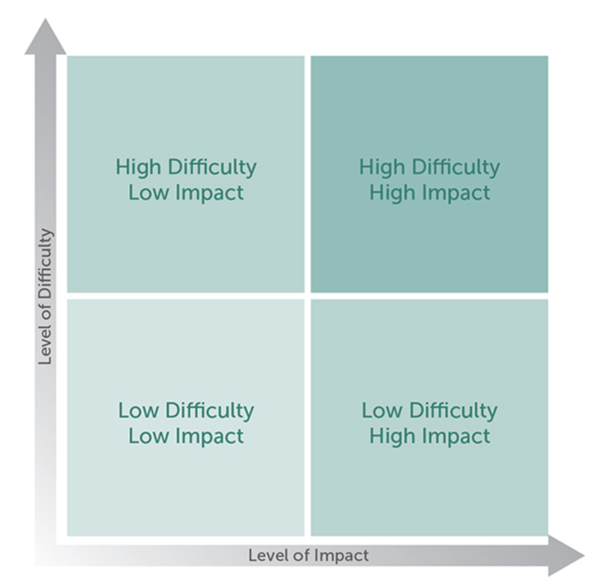
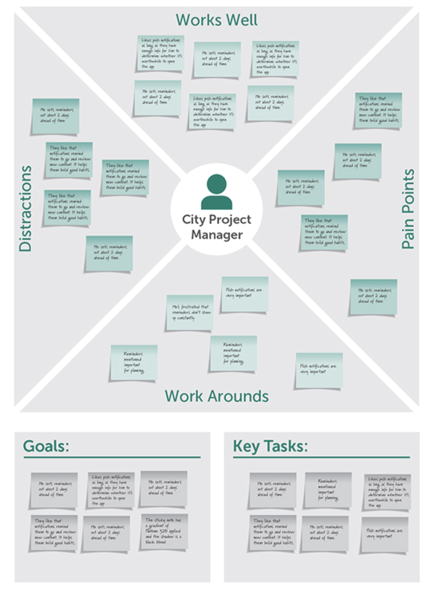

# Outline for Chapters 5-6 of A Project Guide to UX Design
{: .no_toc}

Outline author: Evan Brooks

Outline date: Jan 24th, 2026

# Table of Contents
{: .no_toc}

* TOC
{:toc}

# Essential Questions:

## 1. What does discovery mean in the context of UX design?

[Discovery is the upfront work of making sure the work you think you need to engage in is the right work to be doing at all.](https://learning.oreilly.com/library/view/a-project-guide/9780138188283/ch05.xhtml#ch05lev1sec1:~:text=Discovery%20is%20the%20upfront%20work%20of%20making%20sure%20the%20work%20you%20think%20you%20need%20to%20engage%20in%20is%20the%20right%20work%20to%20be%20doing%20at%20all.)

In the context of UX design, discovery is focused on determining whether you are focusing on the right design challenges, and "what the real challenge might be".

## 2. What are the 9 stages of the example process flow they give you in chapter 5? 

The nine stages [listed in chapter 9](https://learning.oreilly.com/library/view/a-project-guide/9780138188283/ch05.xhtml#ch05lev1sec1:~:text=Based%20upon%20our%20experiences%20leading%20discovery%20efforts%2C%20Discovery%20happens%20in%20several%20key%20phases%20(Figure%205.1).%20We%E2%80%99ll%20look%20at%20some%20of%20these%20more%20closely%20in%20the%20sections%20that%20follow%3A)
are:

- Project kickoff meeting
- Preparation and pre-planning: secondary research
- Stakeholder interviews: determining the needs of stakeholders
- Kickoff workshop
- Detailed discovery planning: determine what exact research you need to do based on above, final hypothesis
- Research and investigation: spend time with users, experts, anyone else who can help you understand the hypothesis
- Prototyping: if time permits, build a prototype to get feedback from users/stakeholders
- Analysis and modeling: synthesize the data and convert it to artifacts, including a presentation
- Presenting your findings: share what you've learned, status of hypothesis (validated?)

## 3. What is the purpose of a kickoff? 

The kickoff meeting gathers team members, stakeholders, and other interested persons to communicate:
- expectations,
- high level process, and
- get clarity on outstanding items or info needed to progress.

Most importantly, this meeitng gets everyone on the same page.

## 4. Why is discovery planning important?

Discovery planning is important to make sure that you and your design team are solving the right _challenge_ at the right _time_. 

It also helps determine how to proceed to solving the issue. 
Putting time and effort in to determine this upfront reduces the ["risk in large efforts"](https://learning.oreilly.com/library/view/a-project-guide/9780138188283/ch05.xhtml#ch05lev1sec7:~:text=risk%20in%20large%20efforts).

I can personally vouch for this, having seen a lot of effort go into products that are ultimately scrapped in my professional career.

## 5. How is prototyping related to research and analysis? 

Prototyping is often used as a stage of research and analysis to assist in validating the hypothesis you are testing. 

It is an effective tool to make sure the challenge(s) identified are being addressed with the UI you are proposing.

## 6. What are three of the methods from chapter six and what do they look like?

Three activites mentioned are:
- [a prioritization activity](https://learning.oreilly.com/library/view/a-project-guide/9780138188283/ch06.xhtml#ch06lev1sec2:~:text=your%20team%20forward.-,Prioritization%20Activity,-Many%20teams%20face)
- [affinity diagramming](https://learning.oreilly.com/library/view/a-project-guide/9780138188283/ch06.xhtml#ch06lev1sec2:~:text=on%20Prioritization%20Activity.-,Affinity%20Diagram,-Affinity%20diagramming%20is)
- [role empathy mapping](https://learning.oreilly.com/library/view/a-project-guide/9780138188283/ch06.xhtml#ch06lev1sec2:~:text=challenges%20or%20opportunities.-,Role%20Empathy%20Map,-You%20may%20have)

In a **prioritization activity**, participants fill out sticky notes with and idea or thought and place them on a matrix that maps impact and difficulty. 

(I imagine that the best ideas are those in the "low difficulty/high impact" quadrant.)
Optionally, participants then use dot voting to determine the priority between stickies. 

When completing an affinity diagram, participants first create stickies, then group them according to their shared characteristics.

Finally, in a role empathy mapping activity, participants select a user role then brainstorms the goals, tasks, and pain points that the role experiences in their jobs. 

This activity helps to align participants around the needs of users.

# Reflection Questions

## 1. If you had to make a discovery plan for a group project, how would you go about that?

Ideally, I would start the planning process by working with the group members and the instructor as the primary stakeholders in the project. I would speak with these individuals and ensure their needs are met in the process. 

After this, the group should decide upon a hypothesis and conduct user or secondary research, possibly generating prototypes to validate along the way. 

Ultimately, I would expect the group to create a design brief and a final presentation to the instructor.

## 2. What resources could you use to help you with discovery? 

Useful resources for students include: 
- industry research, either availble publicly or via the UNO library system,
- wireframing tools like Figma, or
- using generative AI to generate protoptypes quickly.

## 3. Which activities from chapter 6 seemed the most fun to you?

As an engineer who values "bang for your buck", the prioritization matrix activity is most appealing to me. 

Engineers excel at thinking of technical solutions, but mapping them on the "impact vs difficutly" scale really helps clarify what is worth doing _right now_ when everyone's time is limited.

## 4. If you had to perform a collaboration activity to design a better book, which one would you use and why?

I would suggest a role empathy mapping excercise. 
Placing the "types of readers" front and center would help designers focus on the specific needs of students, instructors, or practictioners, not the limitations of the technical product.

This activity can also help de-prioritize features/aspects that are unhelpful to the target audience, which many books struggle with. (e.g. books for practictioners need examples, not stories)

# Miscellania

- I've used ["dot voting"](https://gamestorming.com/dot-voting)
  before, but I had no idea it was a formal process. I'd love to use this more at FNBO to help prioritize features/changes on the applications I support.

- This [list of "assumption" questions](https://learning.oreilly.com/library/view/a-project-guide/9780138188283/ch05.xhtml#ch05lev1sec3:~:text=Questions%20for%20the%20team%20to%20work%20through%2C%20both%20internally%20and%20externally%20with%20the%20customers%2C%20include%3A)
  is one of the best starting points for a "new feature meeting" I've ever seen, independent of UX design: 
    - What should the final product provide to the end users?
    - What does the solution add to or remove from the user’s experience to make it more effective and efficient?
    - How does the organization benefit from the final product?
    - What would make the solution be considered reliable or trusted by end users?
    - How would the solution reduce the user’s burden and make it easier for them to accomplish their goals?
    - What is considered the biggest risk to the solution being a success for the organization or for end users?
    - How can the team mitigate those risks early on and avoid them later on in development?

- The books focuses heavily in chapter 5 & 6 on "getting the right people in the room." 
  In my experience, this is deeply _underrated_. 
  The success or failure of a given project at FNBO can often be predicted based on how involved key stakeholders are early on.