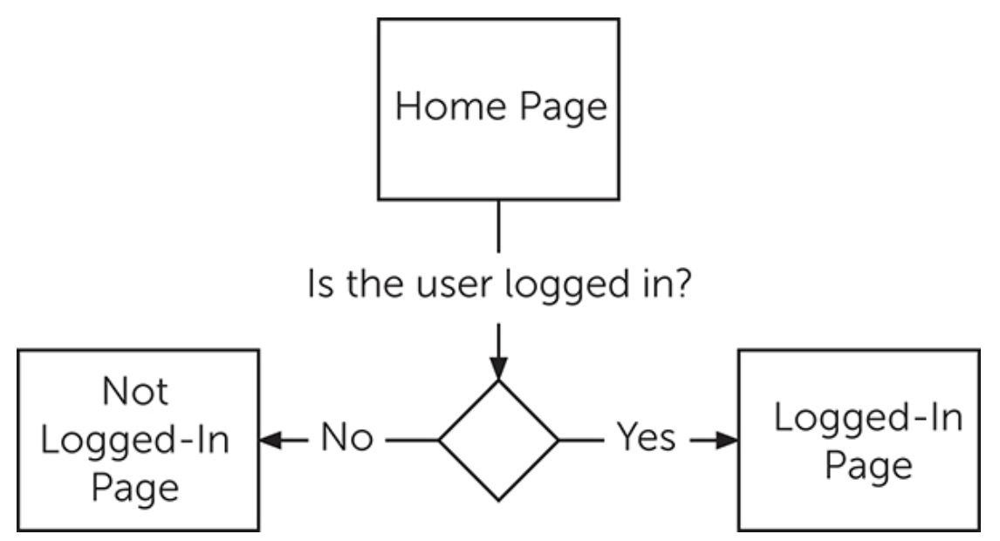
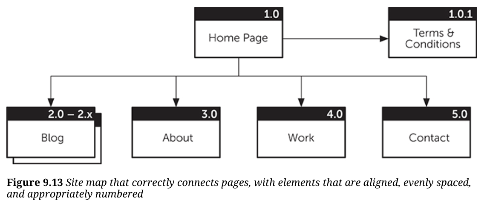
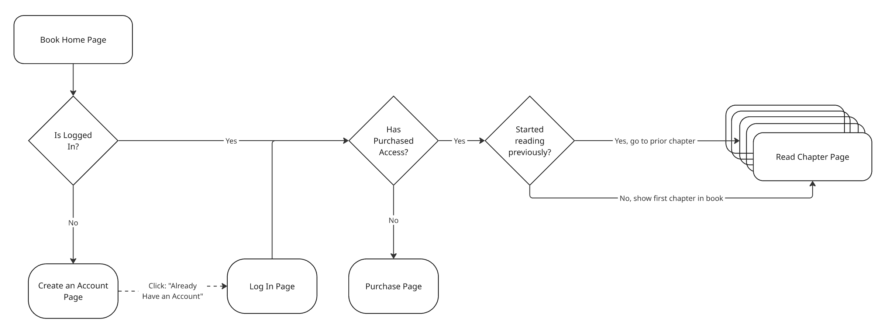

# Outline for Chapter 9 of A Project Guide to UX Design
{: .no_toc}

Outline author: Evan Brooks

Outline date: Feb 8th, 2026

# Table of Contents
{: .no_toc}

* TOC
{:toc}

# Essential Questions:

## 1. Why is mapping critical for good UX design?

Mapping helps the practitioner understand ["what needs to happen for users, where users can go, and the behaviors and needs of your users."](https://learning.oreilly.com/library/view/a-project-guide/9780138188283/ch09.xhtml#:~:text=what%20needs%20to%20happen%20for%20users%2C%20where%20users%20can%20go%2C%20and%20the%20behaviors%20and%20needs%20of%20your%20users)

It provides insight into sticking points for users and also opportunities where additional value can be provided to users and the business.

## 2. What is a process map?

Process maps show the steps and decision points for a user's journey through the product.

Process maps include decision points and user actions leading to specific outcomes. 
Process maps seem similar if not identical to process flow charts from software engineering.

Example: 

More detailed example:

## 3. Describe each of these components of a process map

- Page/screen/view - represents a single page/screen/view in the user journey, represented as a simple rectangle in the process map
- Pagestack - multiple pages of similar content. Example: blog pages in from the same website. Designed once, but clickable between to navigate.
- Decision Point - shows the path a user takes based on the answer to a question
- Connectors and Arrows - used to show movement or progress between pages, when a crossbar is added to the arrow you can't "go back" to the prior page
- Conditions - dotted lines represent links from one page to another that are conditional on some other action or event

## 4. Describe one common mistake when making a process map

The first common mistake highlighted in the text is that of "sloppy connections."

Sloppy connections are lines or arrows that don't quite reach the target object, or which leave the source object and arrive at the destination object at weird angles.

## 5. What is a journey map and how do you make one?

Journey maps are chronological visualizations of users' progression to a specific goal through the product.
They focus on the user's feelings, motivations, and questions at each step of the process.

They help teams reveal pain points or opportunities for improvement in the user experience.

# Reflection Questions

## 1. How does a good map help you improve design?

Maps help you identify the "primary" or "happy" paths through your website. 
This can allow you to focus your design around ensuring that users follow this path, and that the site serves the primary needs of its users very directly and obviously.

## 2. How does a good map help a team implement a design?

As a software engineer who has worked with site maps, I find one of their primary benefits to be that they make it absolutely clear what portions of the website are connected to others.
There is no ambiguity in a site or process map, or if there is (such as an unclear decision point on the tree), that will often _trigger the discussion_ to clarify the requirement.

In general, I find that a good process map gives enough detail for team members to truly understand the solution, and, _critically_, point out the flaws in the solution as designed. 

## 3. Please sketch out a rough process map of the digital textbook (by hand or using one of the listed tools in the book)

## 4. Please sketch out a rough journey map of the digital textbook

- Actions: 
    - Finding the textbook on the O'Reilly website
    - Logging in to the O'Reilly website
    - Navigating to the textbook page
    - Finding the chapter you want to read
    - Reading the chapter
    - Taking notes on the chapter
    - Navigating to the next chapter
- Thoughts/Feelings: 
    - Positive: "Textbook title search worked on the first try, nice!"
    - Negative: "Why do I have to log in to read the textbook? Why can't it remember that I'm logged in?"
    - Positive: "Chapters are shown clearly on the right side of the page."
    - Positive: "It's nice that it remembers the chapter I'm on when I log back in."
    - Negative: "I wish chapters had summaries at the start so I could quickly find the one I want to read."
    - Positive: "The UI adjusts well to making it half size so I can take notes"
    - Negative: "I wish I could read the whole book offline instead of having to open a tab for each chapter on the airplane."
- Obstacles: 
    - Logging in is an obstacle, especially if the site doesn't remember that I'm logged in.
    - Finding the right chapter is an obstacle, especially if the chapter titles aren't descriptive enough
      or there are no summaries. (I don't _know_ the contents, thus why I'm reading.)
    - No way to read offline is an obstacle, especially for users who want to read on the go.
- Opportunities: 
    - Adding a "remember me" feature to the login process would reduce friction and make it easier for users to access the textbook.
    - Adding chapter summaries would help users quickly find the chapter they want to read.
    - Adding an offline reading mode would allow users to read the textbook on the go without 
      needing an internet connection.

