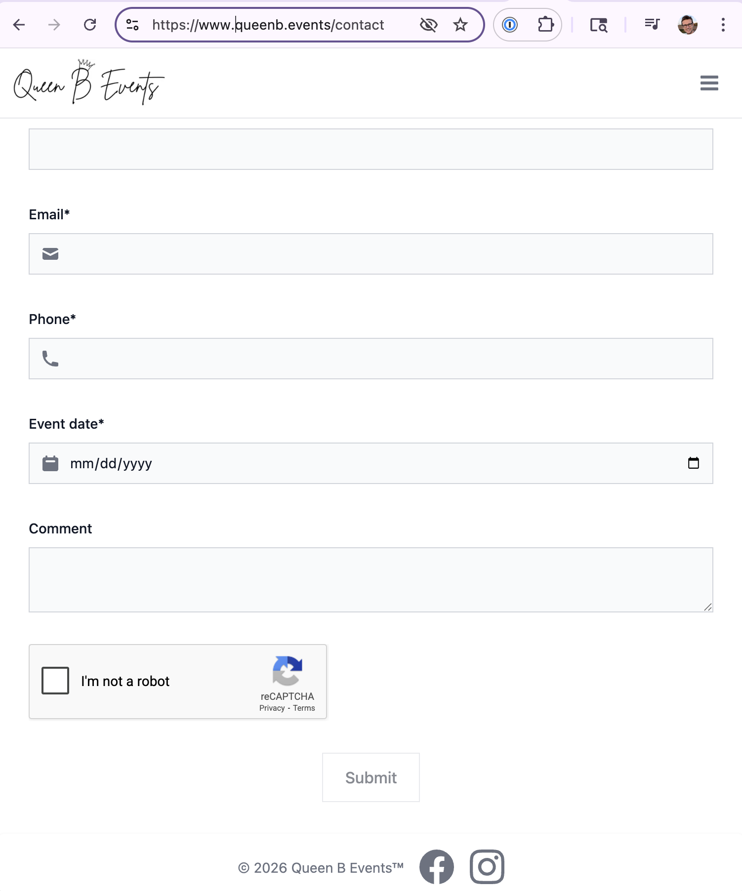

# Assignment: Playing with Nordcraft

## Website Created (public link)

[Evan Brooks' Nordcraft Tutorial](https://evanbrooks_uxdesign_nordcraft.toddle.site/)

## Reflection questions

### 1. Which tool did you select and why?

I selected NordCraft for two reasons:
1. It is an open-source tool, which appeals to me as a software engineer who depends on open-source software daily. 
2. The collaboration feature based on git branching appealed to me, as I have experience with git branching and merging in my work as a software engineer.
3. I wanted to try a tool that, if I liked it, I could continue to use for free in the future since I don't plan to pay for Dreamweaver post-graduation.

### 2. What is your previous experience with the tool or the languages/approaches it uses?

I had no prior experience with either Nordcraft or Dreamweaver. 
However, I have over 7 years of experience working with HTML, CSS, and JavaScript/TypeScript in a professional capacity, primarily via frameworks like
React, Angular, and Vue.js.

I've written "plugin" style chunks of HTML/CSS/JS that
add functionality to existing server-rendered sites all the way up to full single-page applications (SPAs) built with React and served via Next.js.

**Note:** Most of the professional work I do is in TypeScript these days, and is creating full SPAs.

### 3. What tutorial did you select (post a link)? 

[Learn Nordcraft Lesson 1: Build a Linktree-style personal website for Rick Astley](https://www.youtube.com/watch?v=3U0UVetAQNc&list=PLG5nC6v1NoPRQfx04DKnUySB0SRszxdjx&index=3)

### 4. Why did you select the tutorial? 

I selected this tutorial because as a software engineer I had created this style of website before with both React and plain HTML/CSS/JS.
I wanted to see how Nordcraft compared to these more traditional approaches for creating a simple personal website.

I felt that this would give me a good sense of the strengths and weaknesses of Nordcraft as a tool for building websites. 
This includes whether I wanted to revamp my personal site from its current iteration, which is built on React served on Next.js.

### 5. Do you think the tutorial was useful? Why or why not?

I found the tutorial extremely useful as an engineer. 
I liked how the instructor mapped basic HTML/CSS/JS concepts to Nordcraft features.

I also appreciated how easy it is in Nordcraft to extract chunks of visual design into reusable components. 
This mirrors the component-based architecture of modern front-end frameworks like React, Vue, and Angular that I'm used to working with.

### 6. What is something you learned from this process?

I learned that even for a professional working on simple sites, it is sometimes
possible to iterate faster using a visual design tool like Nordcraft rather than coding everything by hand.

This is especially true when the accelerating power of AI is not available to you, either due to lack of access or due to organizational policies.
When AI is available, I currently still find that coding by hand is faster for me personally, as I can get exactly what I want quickly via code.

### 7. What is something you can do to learn more about the tool you selected? 

I'd love to spend some time determining how to integrate Nordcraft into custom back-end APIs. 
For example, when building the "Contact Us" form
on [Queen B Events](https://www.queenb.events/contact), I created a custom back-end API to handle form submissions including reCAPTCHA validation and email sending:

I'd like to see how Nordcraft could be used to build a similar form that submits to a custom back-end API.

### 8. Provide a link to your work or a screenshot of your work

[Evan Brooks' Nordcraft Tutorial](https://evanbrooks_uxdesign_nordcraft.toddle.site/)
