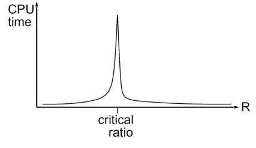
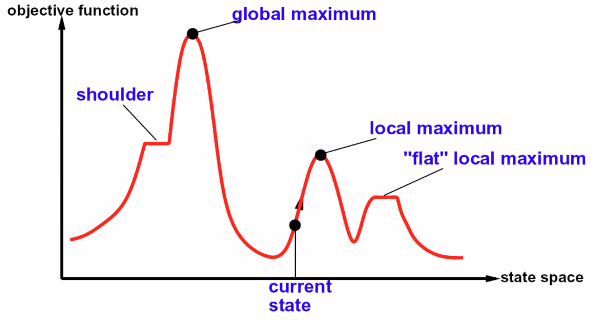
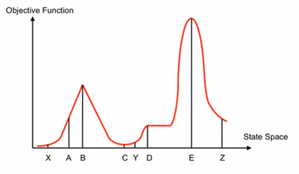
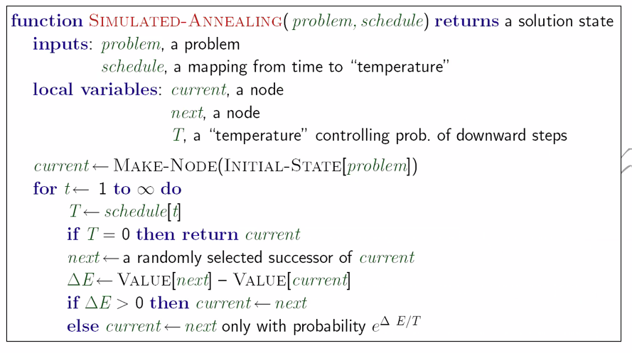

# Lecture #10 Notes - Filtering and Ordering
- Author: Evan Brooks
- Date: Monday, October 5th, 2026

## Tree Decomposition*
- Idea: create a tree-structured graph of mega-variables
- Each mega-variable encodes part of the original CSP
- Subproblems overlap to ensure consistent solutions
- [See lecture 9 notes for more details](./lecture_9_notes.md#tree-decomposition)

## Iterative algorithms for CSPs
- Local search methods typically work with "complete" states, i.e. all variables assigned, but not necessarily consistent
- To apply to CSPs:
  - Take an assigment with unsatisfied constraints
  - Operators: _reassign_ variable values
  - No fringe! Live on the edge
- Algorithm: While not solved, 
    - Variable selection: randomly select any conflicted variable
    - Value selection: min-conflicts heuristic
        - Choose a value that violates the fewest constraints
        - i.e. hill climb with $h(n) = \text{total number of violated constraints}$

## Performance of min-conflicts
- Given random initial state, can solve n-queens in almost constant time for arbitrary $n$ with high probability (e.g. $n=1,000,000$)

- The same appears to be true for any randomly-generated CSP _except_ in a narrow range of the ratio:

$$
R = \frac{\text{number of constants}}{\text{number of variables}}
$$

- Also runs forever if there is no solution to the problem, which can 
  be an issue (aka doesn't guarantee exhaustivity)

- Variant of back-tracking search that does something similar, where we 
  start with an exhaustive search, but if we find lots of constraint 
  violations moving forward, we wipe out the current fringe, pick a new 
  random starting point, and start again

## Hill climbing
- Simple general idea:
    - Start wherever
    - Repeat: move to the best neighboring state
    - If no neighbors better than current, quit
- What's bad about this approach?
    - Complete? No, could get stuck on a hill and miss the mountain.
    - Optimal? No, could get stuck on a hill and miss the mountain.
- What's good about it?
    - If it finds a solution, it will find it quickly.

**Hill Climbing Diagram:**

## Hill climbing quiz

- Starting from X, where do you end up?
    - Answer: B
- Starting from Y, where do you end up?
    - Answer: D
- Starting from Z, where do you end up?
    - Answer: E

## Simulated annealing
- Idea: Escape local maxima by allowing downhill moves
    - But make them rarer as time goes on

