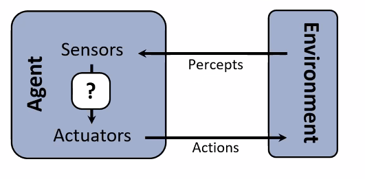

# Lecture #1 Notes - Introductory Lecture for Artificial Intelligence
- Author: Evan Brooks
- Date: Monday August 31st, 2026

## Textbook

Recommended textbook: [Russel & Norvig, AI: A Modern Approach](https://www.amazon.com/dp/0136042597?lv=shuf&channelId=500&plpRedirect=mhFallback)

Note: Not a course textbook, so our presentations will not necessarily follow the textbook. However, it is a good reference for further reading.

## Scope of course

- 3 programming projects in the class
- 1 practice project (project 0), now available and due Wednesday September 2nd, 2026
- Use Piazza for live discussion topics
- Use Gradescope for live graded assignments

## Technology pitfalls

- Can't guarantee the truthfulness of its answers
- Example: 2023, where two lawyers used ChatGPT 
  to write a legal brief in Manhattan federal court, and it was completely wrong. The lawyers were
  not aware of this, and the judge was not happy.

- Self driving cars have made huge progress, but accidents remain common
- One of the important pieces of science and permanent progress is that results should be _reproducible_. 

> "It's not clear to me that Waymo is reproducible, because ... we don't have the knowledge to engineer the same artifact."
> Dr. Yuliya Lierler

## What is AI?

The science of making machines that:
- think like people,
- act like people,
- think "rationally," or
- act "rationally."

## Rational decisions
Rational in this context is meant a very specificy technical way:
- Rational - maximallly achieving pre-defined goals
- Rationality only concerns what decisions are made (not the thought process behind them)
- Goals are expressed in terms of the _utility_ of the outcomes
- **Being rational means maximizing your expected utility**

A better title for this course would be: **Computational Rationality**

## Maximize your expected utility
- Maximize = find highest possible output score
- Your = an "agent," any program can be an agent
- Expected utility = value from a mathematical function

## What about the human brain?

- Human minds are very good at making rational decisions, but not perfect.
- Brains aren't as modular as software. This makes them hard (thus far impossible) to reverse engineer.
- Lessons learned from the brain: memory and simulation are key to decision making.
- The building blocks of neural network-based AI models are an extremely simplified version of the building blocks of the human mind.

## Designing rational agents
- An agent is an entity that _perceives_ and _acts_
- A **rational agent** selects actions maximize its (expected) **utility**
- Characteristics of the **percepts**, **environment**, and **action space (set of valid actions)** dictate
  techniques for selecting rational actions

- Starting with simple, single agents with full understanding of the environment
- Ending with environments with multiple agents, agents without full understanding of the environment, and
  agents which learn and refine their own notion of the world and how to behave rationally
- By the end of the course, you will be coding a Pac-Man agent that plays Pac-Man _rationally_

## A short history of AI

## Readings for later

- [Waymo World Model](https://waymo.com/blog/2026/02/the-waymo-world-model-a-new-frontier-for-autonomous-driving-simulation/), used to generate novel or rare scenarios for the car to experience from _existing_ data

