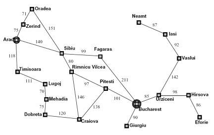
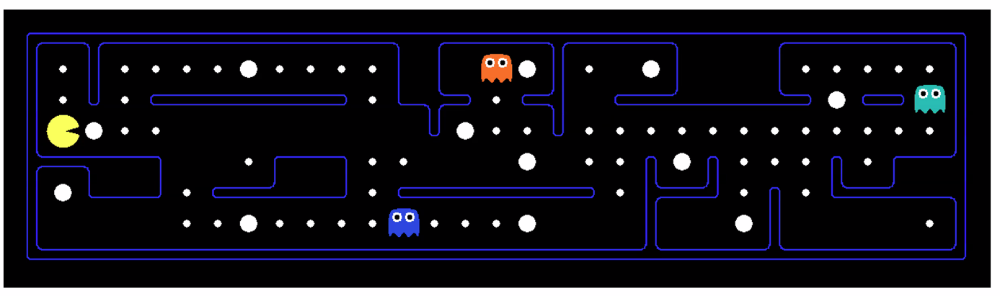
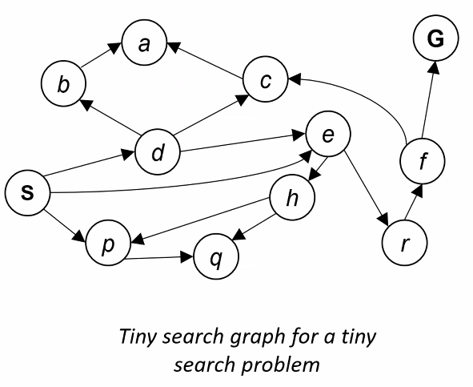
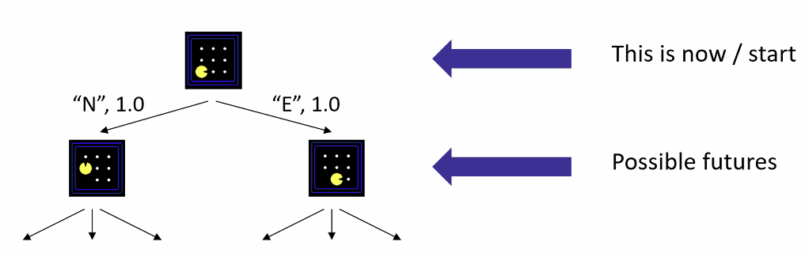

# Lecture #3 Notes - Search Problems
- Author: Evan Brooks
- Date: Wednesday September 9th, 2026

## Announcements
- [Homework 1 (Uninformed Search)](https://mynu.instructure.com/courses/20132/assignments/1268110) is due next Wednesday, September 16th at 11:59pm, submit on Gradescope
- [Reading on AI: Classics on Commonsense Reasoning (Grad students only)](https://mynu.instructure.com/courses/20132/assignments/1268128) is due Sept 16th at 11:59pm: one reading + one paragraph showcasing one new or impressive idea in the article


## Search Problems
- A **search problem** consists of:
  - a state space,
  - a successor function (with actions, costs), and
  - a start state and a goal test.
- A **solution** is a sequence of actions (aka "plan") that leads from the start state to a goal state

### Search problems are models
> What we mean is that search problems can be seen as abstractions of the real problems.
> They are simplified in order to make them easier to solve.
>
> Dr. Lierler

### Example: Traveling in Romania



- State space: cities in Romania
- Start state: Arad
- Goal state: Bucharest (goal test: Is state == Bucharest?)
- Successor function: given a city, return all cities that are directly connected to it by roads. Cost = distance of the road.
- Solution?

### What's in a state space?
- The **world state** includes every last detail of the environment, but... 
- A **search state** keeps only the details needed for planning (abstraction)

For example, consider the world state for Pacman. 
- For the Problem of Pathing, we only need:
  - States: (x,y) location
  - Actions: NSEW
  - Successor: update location only
  - Goal test: is (x,y) == (goal_x, goal_y)?

- For the problem of "eating all the dots", we need:
  - States: (x,y) location + which dots have been eaten as booleans
  - Actions: NSEW
  - Successor: update location and possibly whether a dot has been eaten
  - Goal test: are all dots eaten?

### State space sizes
- world state:
  - Agent positions: 120
  - food count: 30 (since each dot can be eaten or not, we have 2^30 possibilities)
  - ghost positions: 12 (since each of two ghosts can be in one of 12 positions, we have 12^2 possibilities)
  - agent facing direction: 4 (NSEW)

- How many...
  - World states? 120 * 2^30 * 12^2 * 4
  - States for pathing? 120
  - States for eating all the dots? 120 * 2^30

### Quiz: Safe passage

- Problem: Eat all the dots while keeping the ghosts "perma-scared" (aka "frightened") so they don't eat you.
- What does the state space have to specify in addition to the agent's position and which dots have been eaten?
  - (agent positions, dot booleans, power pellet booleans, remaining 'scared time')
  - Note that the remaining scared time is a path-dependent property of the state space.

### State Space Graphs



- State space graphs: A mathematical representation of a search problem
  - Nodes are abstracted world configurations
  - Arcs represent sucessors (action results)
  - The goal test is a set of goal nodes (possibly only one)

- In a state space graph, each state occurs only once, even if there are multiple paths (arcs) to reach it
- We can rarely build this graph in memory (it's _way too big_), but it is a useful idea.

> Sidebar: Action languages. The goal of action languages are to come up with languages that can concisely define the state space graph.
> 
> Dr. Lierler

### Search Trees



- A search tree:
  - A "what if" tree of plans and their outcomes
  - the start state is the root node
  - children correspond to successor states
  - Nodes show states, but correspond to PLANS that achieve those states
  - Again, for most problems, we can _never_ build the entire search tree in memory

- There are often lots of repeated structure in the search tree
> Allows pruning? (Evan's commentary)

### State Space Graphs vs Search Trees
- Each NODE in the search tree is an entire PATH in the state space graph
- We construct both on demandand--we construct as little as possible, since they are almost always too big to fit in memory

### Searching with a Search Tree
- Search:
  - Expand out potential plans (tree nodes)
  - Maintain a **fringe** of partial plans under consideration
  - Try to expand as few tree nodes as possible to find a solution

### General Tree Search

```
function Tree-Search (problem, strategy) returns a solution, or failure
  initialize the search tree using the initial state of problem as the root
  loop do
    if there are no candidates for expansion then return failure

    choose a leaf node for expansion according to strategy

    if the node contains a goal state then return the corresponding solution
    expand the chosen node, adding the resulting nodes to the search tree
  end loop
```

- Important ideas: 
  - Fringe
  - Expansion
  - Exploration strategy

- The main question to address: how do we choose which fringe nodes to expand/explore next?
