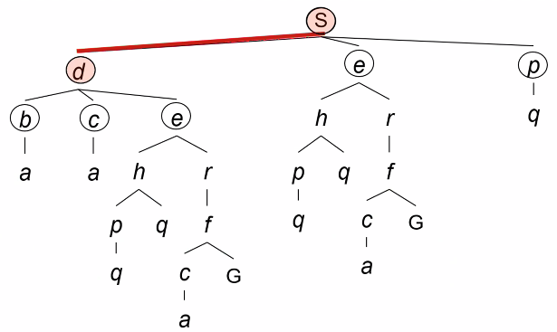
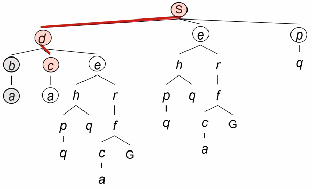
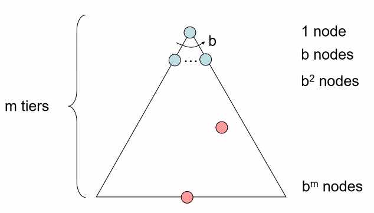
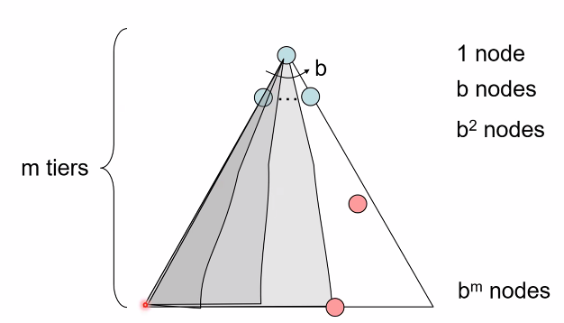
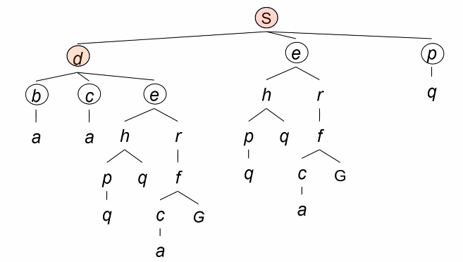
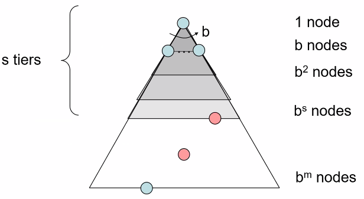
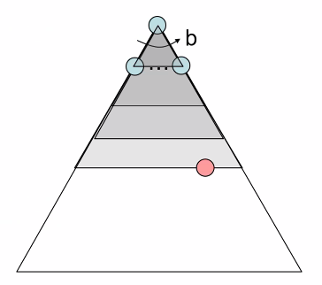
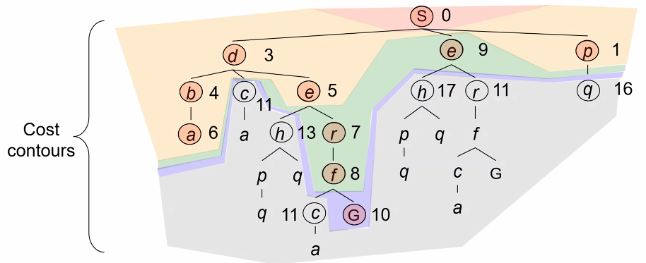
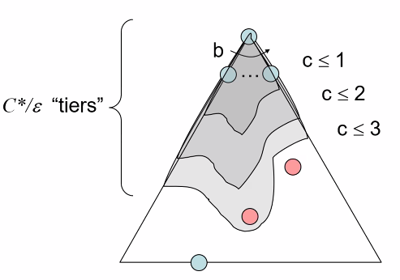

# Lecture #4 Notes - Search Problems continued
- Author: Evan Brooks
- Date: Monday September 14th, 2026

## Search Problems (review from last lecture)
- A search problem consists of:
  - a state space,
  - a successor function (with actions, costs), and
  - a start state and a goal test.
- A solution is a sequence of actions (aka "plan") that transforms from the start state to a goal state

> Important for this lecture: a "state" here is not defined what sort of object it is (something in this set is a state vs not). It is just a set of objects that we can define a successor function on.

The _fringe_ is the set of nodes to explore that have been generated but not yet expanded. 
At the beginning, only the start state is in the fringe. 
As we expand nodes, we add their successors to the fringe. 

The _big question_ for search problems: how do we choose which fringe nodes to expand/explore next?

## Depth-First Search (DFS)
- Strategy: expand a deepest node first
- Implementation: use a stack (Last In, First Out = LIFO) for the fringe

Based on the above, assuming we have expanded S and S → D, the fringe consists of:
- S → D → B,
- S → D → C,
- S → D → E,
- S → E, 
- S → P

Because we are doing a depth-first search, we will expand the deepest node first. All of the children of S → D (B, C, and E) are tied in depth (depth = 2), so we need a tiebreaker.

For today, we chose alphabetical order for a tiebreaker, aka (A before B before C etc.), so the next node expanded and explored is S → D → B.

Similarly, given the above have been expanded and checked for goal states, the fringe will consists of:
- S → D → C → A
- S → D → E
- S → E
- S → P
We will expand the deepest node first, which is S → D → C → A.

## Search Algorithm Properties
- Complete: Guaranteed to find a solution if one exists?
- Optimal: Guaranteed to find the best solution (lowest cost) if one exists?
- Time complexity: How long does it take to find a solution?
- Space complexity: How much memory does it take to find a solution?
- Cartoon of a search tree:
    - $b$ is the branching factor, the maximum number of successors of any node (to ensure worst-case analysis)
    - $m$ is the maximum depth of the search tree, if the tree is finite (no loops)
    - solutions at various depths

- Number of nodes in entire search tree: $$1 + b + b^2 + \ldots + b^m = \frac{b^{m+1} - 1}{b - 1} = O(b^m)$$

## Depth-First Search Properties
- What nodes does DFS expand?
    - Some left prefix of the tree, then the next left prefix, etc.
    - Will process the whole tree if it is finite
    - If $m$ is finite, DFS is complete and takes time $O(b^m)$
- How much space does the fringe take?
    - Only has siblings on path to root, so $O(bm)$
- Is it complete?
    - $m$ is finite, yes
    - $m$ is infinite, no unless we prevent cycles (e.g., by keeping track of visited nodes)
- Is it optimal?
    - No, DFS is not optimal. It may find a solution that is not the best. It finds the "leftmost" solution, regardless of depth or cost.

## Breadth-First Search (BFS)
- Strategy: expand a shallowest node first
- Implementation: use a queue (First In, First Out = FIFO) for the fringe'

Assuming we have expanded S and S → D, the fringe consists of:
- S → D → B, 
- S → D → C,
- S → D → E,
- S → E,
- S → P

And we will expand the shallowest node first, which is S → E.

## Breadth-First Search Properties
- What nodes does BFS expand?
    - Processes all nodes above the shallowest solution
    - Let depth of shallowest solution be $s$
    - Search takes time $O(b^s)$
- How much space does the fringe take?
    - Has roughly the last tier (in the worst case), so $O(b^s)$
- Is it complete?
    - $s$ _must be finite_ if a solution exists, so yes, BFS is complete
- Is it optimal?
    - In the special case where all step costs are equal (e.g., $cost = 1$), yes, BFS is optimal
    - Otherwise, no because it fails to consider the cost of the path to a node, only its depth in the tree

## Iterative Deepening
- Idea: get DFS' space advantage with BFS' time/shallow-solution advantages
- Implementation:
    - Run a DFS with depth limit 1. If no solution...
    - Run a DFS with depth limit 2. If no solution...
    - Run a DFS with depth limit 3. etc...

- Isn't that wastefully redundant?
    - Generally most work happens in the lower level searched, so not so bad

## Graph Search
- In BFS, for example, we shouldn't bother expanding the circled nodes (why)?
    - Because we already should have expanded them, and have confirmed that they are not solutions (or we would have found them)
- Idea: never expand a state twice
- How to implement:
    - Tree search + set of explored states ("closed set")
    - Expand the search tree node by node, but...
    - Before expanding a node, check if its state is in the closed set. If it is, skip it. If not, expand it and add its state to the closed set.
- Important: **store the closed set as a set, not a list**. Otherwise, checking if a state is in the closed set will take linear time instead of constant time.
- Can graph search wreck completeness?

## Cost-Sensitive Search - Uniform Cost Search
- So far, we have assumed that all actions have the same cost (e.g., 1). But what if they don't?
- We can use a cost-sensitive search algorithm, which takes into account the cost of actions when deciding which fringe node to expand next. Similar to BFS, but instead of expanding the shallowest node, we expand the node with the lowest path cost (the sum of the costs of the actions taken to reach that node).
- Algorithm name: Uniform Cost Search (UCS)
- Strategy: Expand the cheapest node first (cumulatively)
- Fringe: Stored as a priority queue (priority = cumulative cost)
- Visualization: Cost "contours" like on a topo map

## Uniform Cost Search (UCS) Properties
- What nodes does UCS expand?
    - Processes all nodes with cost less than cheapeast solution
    - If that solution costs $C*$, and arcs cost at least $\epsilon$, then the effective depth is roughly 
    - Takes time $O(b^{\frac{C*}{\epsilon}})$ (exponential in effective depth)
- How much space does the fringe take?
    - Has roughly the last tier, so $O(b^{\frac{C*}{\epsilon}})$
- Is it complete?
    - Assuming the best solution has a finite cost and miminimum arc cost is positive, yes!
- Is it optimal?
    - Yes (Proof next lecture via A*)

