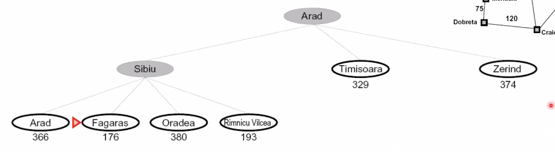
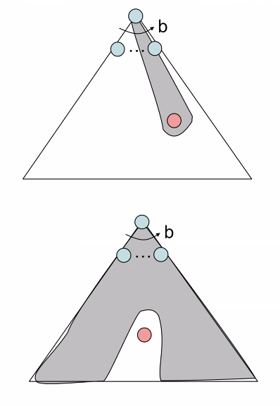

# Lecture #4 Notes - Search Problems continued
- Author: Evan Brooks
- Date: Monday September 16th, 2026

## The One Queue
All of these search algorithms thus far are the same except for fringe strategies
-- conceptually all fringes are priority queues

## Uniform Cost Search
- Strategy: expand lowest path cost
- The good: UCS is complete and optimal
- The bad: 
    - Explores options in "every direction"
    - No information about goal location

## Informed Search

## Search heuristics
- A heuristic is
    - A function that estimates how close a state is to the goal
    - Designed for a specifc search problem
    - Examples: Manhattan distance, Euclidean distance for pathing
    - Typically requires compute time upfront to compute the heuristic

## Example: heuristic function for traversing Romania
- Selected heuristic: Straight-line distance (as a bird flies) to Bucharest
- Compute table like the following:

| City | Distance |
|------|----------|
| Arad | 366      |
| Bucharest | 0   |
| etc. | ...      |

### Greedy Search
- Greedy search follows the heuristic to go "straigth to the goal" by using the heuristic as a tie breaker
- Expand the node that seems the closest

- What can go wrong? 
    - Best-first takes staright 
    - Worst case: like a badly guided DFS

> Uniform cost binds itself to _optimality_, so it only considers the cheapest possible path at any moment. Greedy search binds itself to the _closest_ next state at any given moment. 

### A* Search

- A* search tries to combine the benefits of Uniform Cost Search (moving slowly and finding optimal path in terms of cost) and the speediness of Greedy Search.
    - _Uniform-cost_ orders by path cost, or backward cost $g(n)$
    - _Greedy_ orders by goal proximity, or forward cost $h(n)$
    - **_A* Search_ orders by the sum: $f(n) = g(n) + h(n)$**

### When should A* terminate?
- Should we stop when we enqueue a goal?
    - No: Only stop when we dequeue a goal. 
    - If we stopped when we enqueued the goal, we would guaranatee a solution to the problem, but not guarantee an _optimal solution_

### Is A* Optimal?
- Not always
- When actual bad goal cost < estimated good goal cost
- We need estimates to be less than actual costs for A* to be optimal

### Admissible Heuristics
- Inadmissible heuristics break optimality by trapping good plans on the fringe

- A heuristic is admissible (optimistic) if: 
$$0 <= h(n) <= h*(n)$$
where h*(n) is the true cost to a nearest goal

- Coming up with admissible heuristics is most of what's involved with using A* in practice

> Next time: Proof of optimality for A* tree search. 

> Before next time: Open this deck of slides and review them because you won't understand them when you see them the first time. 
