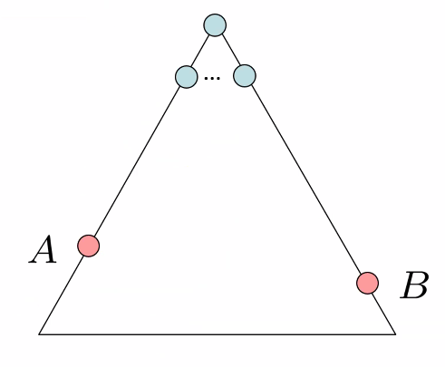
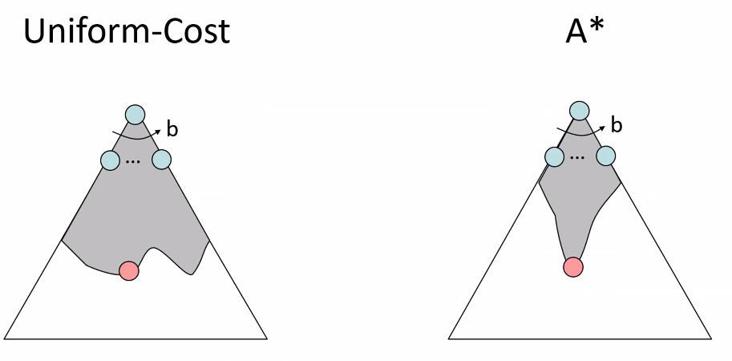
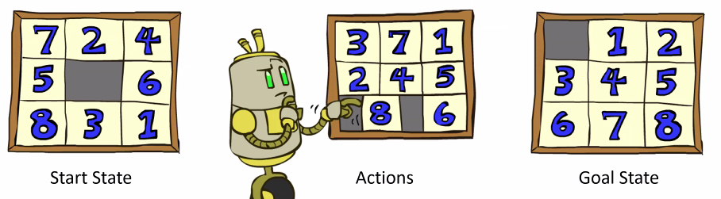
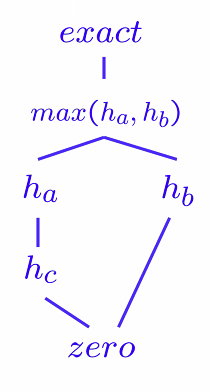
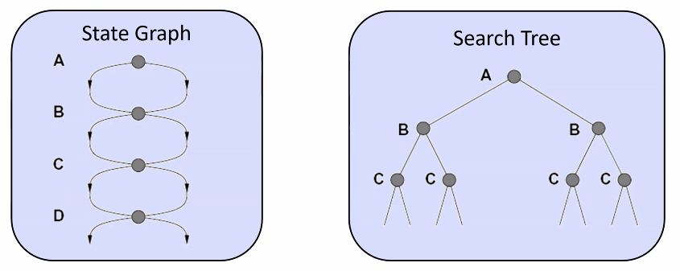
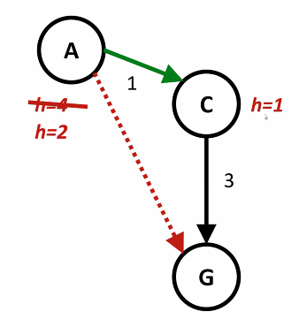
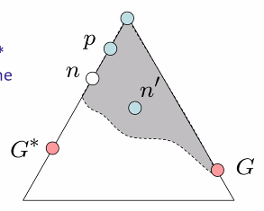

# Lecture #6 Notes - Optimality of A* Search
- Author: Evan Brooks
- Date: Monday September 21st, 2026

## Announcements
- Homework 2 due Wednesday, September 23rd at midnight
- After this lecture, you will have the full theoretical background needed to start on the project. Start now.

### Optimality proof for A* search
Assume:
- A is an optimal goal node
- B is a suboptimal goal noder
- h is admissible

Claim:
- A will exit the fringe before B (if we prove this, then we have proven optimality)

Proof:
- Imagine $B$ is on the fringe
- Some ancestor $n$ of $A$ is on the fringe, too (maybe $A$)
- Claim: $n$ will be expanded before $B$
    1. $f(n)$ is less or equal to $f(A)$ (because it is an ancestor of A)
    2. Reminder: $f(n) = g(n) + h(n)$ (backwards cost aka path cost + forwards cost aka heuristic cost)
    3. What we know: 
        - $g(A) = f(A)$ (because admissible heuristics MUST be 0 at the goal state))
        - $f(n) <= g(A)$
    4. Thus we know that $f(A) < f(B)$
    5. Therefore, $n$ expands before $B$
- Therefore, all ancestors of $A$ must expand before $B$
- Therefore, $A$ expands before $B$
- Therefore $A*$ search is optimal 

### Properties of A*

- Uniform cost expands equally in all directions
- A* expands the cheapest routes, but with a preference in the direction of the goal
- Roughly similar example: when you are playing Marco Polo, you search primarily in the direction of the shout, but you also explore around the directions of the goal since you know the target could have mmoved (imperfect heuristic)

### A* applications (there are many!)
- Video games
- Pathing/routing problems (Evan's note: Google Maps' pathing alg is derived from A*)
- Resource planning problems
- Robot motion planning
- Language analysis
- Machine translation
- Speech recognition
- ...

### Creating heuristics

- Most of the work in solving hard search problems optimally is in coming up with admissible heuristics
- Often admissible heuristics are solutions to _relaxed problems_ where new actions are available (e.g. adding as-a-bird-flies distance table to a road network)
- Inadmissible heuristics are often useful too (optimality may be _overrated_ for some search problems with many solutions that aren't all that different in time + memory costs)

### Example: 8 puzzle

- What are the states?
    - There are "9" unique numbers, and nine places they can be, once you select one number for space "0", then you have eight options for space "1", then seven options for space "2", etc. 
    - Answer: 9!
- How many states?
    - Answer: 9! = 362,880 states
- What are the actions?
    - Swap the "empty space" with any directly adjacent number (not on diagonals, only valid swaps are swapping left, right, top, or down)
- How many successors from the start state?
    - 4, one for each of swapping 5, 2, 6, and 3 with the empty blank
- What should the costs be? 
    - Answer: Simple count of the number of moves taken thus far, each action has the same cost = 1

- Heuristic option 1: Number of tiles currently misplaced
    - Why is it admissible?
    - $h(start) = 8$
    - This is a relaxed-problem heuristic, because you can't take all the tiles out and put them back in order. 
- Heuristic option 2: What if we had an easier 8-puzzle where any tile could slide any direction at any time, ignoring other tiles?
    - Calculating the total _Manhattan distance_ across ALL tiles from their final destination
    - Why is it admissible?
    - $h(start) = 3 + 1 + 2 + ... = 18
- How about using the actual cost as a heuristic?
    - Would it be admissible? YES
    - Would we save on nodes expanded? Yes, AFTER we have computed the solution the hard way
    - What's wrong with it? You've done all the work upfront

> Generally, the more precise the heuristic, the more computation will be involved but the 

Heuristics compared:
| Heuristic         | ..4 step solution | ..8 step solution | ..12 step solution |
|-------------------|-------------------|-------------------|--------------------|
| # tiles misplaced | 13                | 39                | 227                |
| Manhattan sum     | 12                | 25                | 73                 |

- With A*: a trade-off between quality of estimate and work per node
    - As heuristics get closer to the true cost, you will expand fewer nodes but usually do more work per node to copute the heuristic itself

### Trivial heuristics, Dominance
- Dominance: $h_a >= h_c$, if 

$$$
forall{n}: h_a(n) >= h_c(n)
$$$

- Heuristics form a semi-lattic:
    - Max of admissible heuristics is itself admissible: $h(n) = max(h_a(n), h_b(n))$

- Trivial heuristics:
    - bottom of lattice is the zero heuristic (gives us uniform cost search)

### Tree search: stop doing extra work!
- Failure to detect repeated states can cause _exponentially more work_

- Idea for _graph search_: never expand a state twice
- How to implement:
    - Tree search + set of expanded states ("closed set")
    - Expand the search node by node, but
    - Before expanding the node, check if in the closed set and if so skip it
    - Otherwise, expand it and if not the goal put it in the closed set

### Consistency of heuristics
- Main idea: estimated heuristics costs $<=$ actual costs
    - Admissibility: heuristic cost $<=$ actual cost to goal
    - Consistency: heuristic "arc" costs $<=$ actual cost for each arc
- Consequences of consistency:
    - The $f$ value along a path never decreases: $h(A) <= cost(A to C) + h(C)
- When heuristic is both admissible and consistency, then A* graph search is optimal

### Optimality of A* Graph search
- Sketch: consider what A* does with a consistent heuristic
    - In tree search, A* expands nodes in increasing total f-value (f-contours)
    - Proof idea: the optimal goal(s) have the 

Proof:
    - Assume some n on path to G* isn't in queue when we need it, because some worse n' for the same state dequeued and expanded first
    - Take the highest such n in the tree
    - Let p be the ancestor of n that was on the queue when n' was popped
    - $f(p) < f(n)$ because of consistency
    - $f(n) < f(n')$ by construction (we claimed $n'$ is suboptimal)
    - Then, $f(p) < f(n) < f(n')$, so $f(p) < f(n)$ and $p$ _would have been expanded before_ $n'$
    - Thus, we have a contradiction!

### optimality
- Tree search:
    - A* is optimal if heuristic is admissible
    - UCS is a special case when heuristic is 0 for all values
- Graph search:
    - A* is optimal if heuristic is consistenc
    - UCS is optimal (h = 0 for all nodes)
- Consistency implies admissibility, but NOT the other way around
- In general, most natural admissible heuristics tend to be consistenc, especially if from relaxed problems

### A* Summary
- A* uses both backward and forward costs
- A* is optimal with admissible/consistent heuristics
- Heuristic desig is key: often use relaxed problems