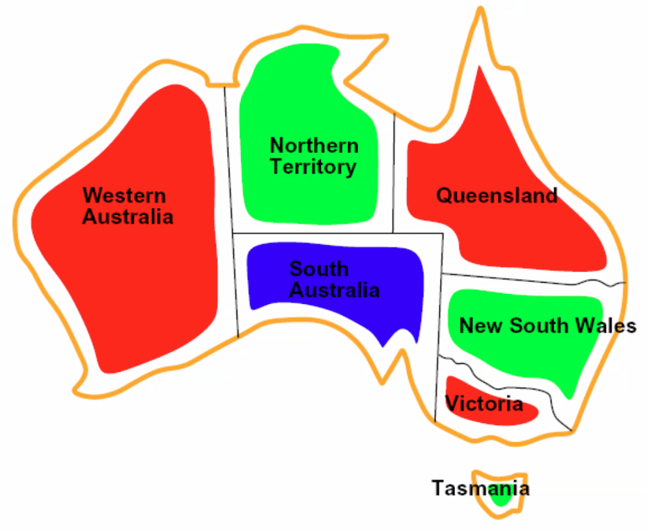
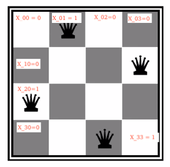
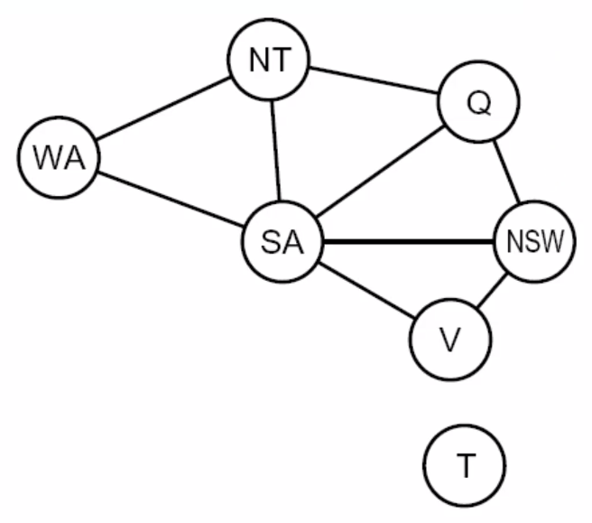

# Lecture #7 Notes - Constraint satisfaction problems
- Author: Evan Brooks
- Date: Wednesday, September 23rd, 2026

## Constraint Satisfaction problems

### What is search for?
- Assumptions about the world: single agent, deterministic actions, fully observed state, discrete state space
- Planning: sequences of actions
    - The path to the goal is the important thing
    - Paths have various costs, depths
    - Heuristics give problem-specific guidance
- Identification: assignments to variables
    - The goal itself is important, not the path
    - All paths at the same depth (for some formulations)
    - CSPs (constraint satisfaction problems) are specialized for identification problems

> It's really not the path from the start state to the goal state, but finding/identifying
> the goal state.
### Standard search problems vs CSPs

- Standard search problems:
    - State is a "black box": arbitrary data structure
    - Goal test can be _any_ function over states
    - Successor function can also be anything

- Constraint satisfaction problems (CSPs):
    - A special subsert of search problems
    - State is defined by variables $X_i$ with values from a domain $D$ (sometimes $D$ depends on $i$)
    - Goal test is a _set of constraints_ specifying allowable combinations of values for subsets of variables

- Simple example of a _formal representation language_
- Allows useful general-purpose algorithms with more power than standard search algorithms

### CSP example 1 - Coloring states on a map
- Variables: $WA, NT, Q, NSW, V, S, SA, T$
- Domains: $D = \{red, green, blue\}$
- Constraints: adjacent regions must have different colors
    - Implicit: $WA \neq NT$
    - Explicit format: $(WA, NT) \in \{(red,green),(red,blue),...\}$
- Solutions are assignments satisfying all constraints, e.g.: 
```math
\{ WA=red, NT=green, Q=red, NSW=green, V=red, SA=blue, T=green \}
```



### CSP example 2: N-queens
Problem: Arrangements of k Queens on an N-by-N chess board such that no queens can attack one another

- Formulation 1:
    - Variables: $X_{ij}$, where each variable represents a position on the board
        - Ex: $X_{0, 0}$ is the top left square
    - Domains: $\{0, 1\}$
    - Constraints: "place the queens so that they cannot attack each other"
    
Example solution:


Implicit definition:

$$
\sum_{\substack{i,j}} X_{i,j} = N
$$

- Formulation 2:
    - Variables: $Q_k$ - as many Q variables are there are rows
    - Domains: $\{1, 2, 3, ...N\}$
    - Constraints:
        - Implicit: $\forall{i, j}\;\text{non-threatening}(Q_i, Q_j)$
        - Explicit: $(Q_1, Q_2) \in \{(1,3), (1, 4), ...\} ...$

### Constraint graphs

Example constraint graph for map-coloring problem:



- Binary CSP: each constraint relates (at most) two variables
- Binary constraint graph: nodes are variables, arcs show constraints
- General-purpose CSP algorithms use the graph structure to speed up search. e.g. Tasmania is an _independent_ subproblem! 

### Constraint graph example 2: cryptarithmetic
- Variables: $\text{F}\:\text{T}\:\text{U}\:\text{W}\:\text{R}\:\text{O}\:X_1\:X_2\:X_3$
- Domains: $\{0, 1, 2, 3, 4, 5, 6, 7, 8, 9\}$
- Constraints: 
    - Implicit: $\text{alldiff}(F,T,U,W,R,O)$
    - $O + O = R + 10 \cdot X_1$
    - $...$

### Constraint graph example 3: Sudoku
- Left to us for self-study, bring questions to next class

