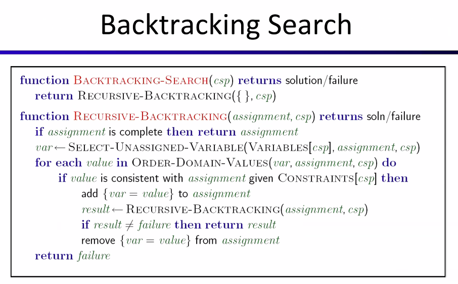
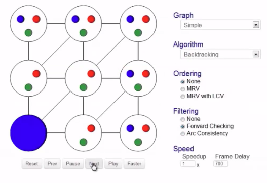

# Lecture #7 Notes - Varieties of CSPs and Constraints
- Author: Evan Brooks
- Date: Monday, September 28th, 2026

## Varieties of CSPs 
- Discrete variables
    - Finite domains 
        - Size $d$ means $O(d^n)$ complete assignments
        - e.g. boolean CSPs, including boolean satisfiability (NP-complete)
    - Infinite domains (integers, strings, etc.)
        - e.g. job scheduling, variables are start/end times for each jobs
        - linear constraints solvable, nonlinear undecidable
- Continuous variables
    - Variables over reals
    - Linear constraints solvable in polynomial time by LP methods

## Varieties of constraints
- Unary constraints involve a single variable (equivalent to reducing domains), e.g.: $\text{SA} \neq green$
- Binary constraints involve pairs of variables, e.g.: $\text{SA} \neq \text{WA}$
- Higher order constraints involve 3 or more variables: e.g. cryptarithmetic column constraints
- Preferences (aka soft constraints);
    - E.g. Red is better than green
    - Often representable by a cost for each variable assignment
    - Gives constrained optimization problems (we'll ignore these until we get to Bayes' nets)

## Real-world CSPs
- Assignment problems: e.g. who teaches what class
- Timetabling problems: which class is offered and where?
- Hardward configuration
- Transportation configuration
- Factory scheduling
- Circuit layout
- Fault diagnosis
- ... lots more
- Many real-world problems involve infinite, discrete variables (aka across the integers)

## Solving CSPs - standard search formulation
- Standard search formulation for CSPs
- States defined by the values assigned so far (partial assignments)
    - Initial state: the empty assignment $\{\}$
    - Successor function: assign a value to an unassigned variable
    - Goal test: are all variables assigned and all constraints satisified?

## Search methods
- What would breadth-first search do?
- What would depth-first search do?
- What problems does naive search have?

## Backtracking search
- Backtracking search is the basic uninformed algorithm for solving CSPs
- Idea 1: One variable at a time
    - Variable assignments are commutative, so fix ordering
    - i.e. [WA = red, then NT = green] same as [NT = green, then WA = red]
    - Only need to consider assignments to a single variable at each step
- Idea 2: Check constraints as you go

- Backtracking = Depth First Search + variable ordering + fail-on-constraint-violation
    - "variable ordering" = `Order-Domain-Values` function above
    - "fail-on-constraint violation" = check of constraints occurring in line `if value is consistent with assignment given Constraints[csp]`
- What are the choice points?

## Improving backtracking
- General-purpose ideas give huge gains in speed
- Ordering:
    - Which variable should be assigned next?
    - In waht order should its values be tried?
- Filtering: can we detect inevitable failure early?
- Structure: can we exploit the problem structure?

## Filtering
- Filtering: Keep track of domains for unassigned variables and cross off bad options (erase invalid adjacent states based on what we currently have assigned)

- Forward checking: Cross off values that violate a constraint when added to the existing assignment

## Consistency of a single arc
- An arc $X \rightarrow Y$ is _consistent_ **iff** for every `x` in the tail there is _some_ `y` in the head which could be assigned without violating the constraint
- Forward checking: enforcing consistency 

## Arc consistency of an entire CSP
- A simple form of propagation makes sure _all_ arcs are consistent
- Important: if X loses a value, neighbors of X need to be rechecked
- Arc consistency detects failure earlier than forward checking
- Can be run as a preprocessor or after each assignment
- Downside is that it requires computation and traversing through our database of constraints
- Once a node's set of valid assignments is updated due to a constraint violation, we must all visit all adjacent nodes and recheck for constraint violations there, and so on

- AC-3 enforces total arc consistency in a CSP, has runtime complexity $O(n^2d^3)$

## Limitations of arc consistency

- After enforcing arc consistency:
    - Can have one solution left
    - can have multiple solutions left
    - Can have no solutions left (and not know it)
- Arc consistency still runs inside a backtracking search!

