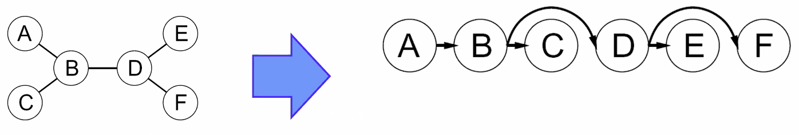
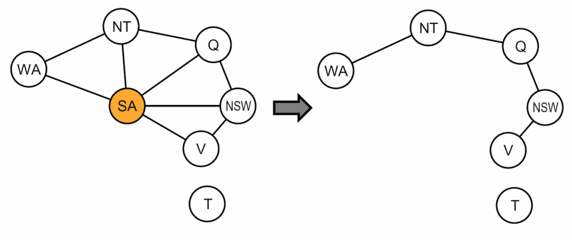
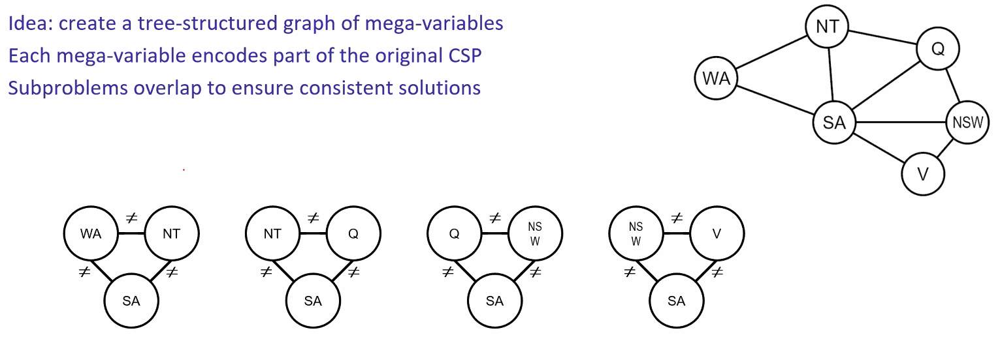
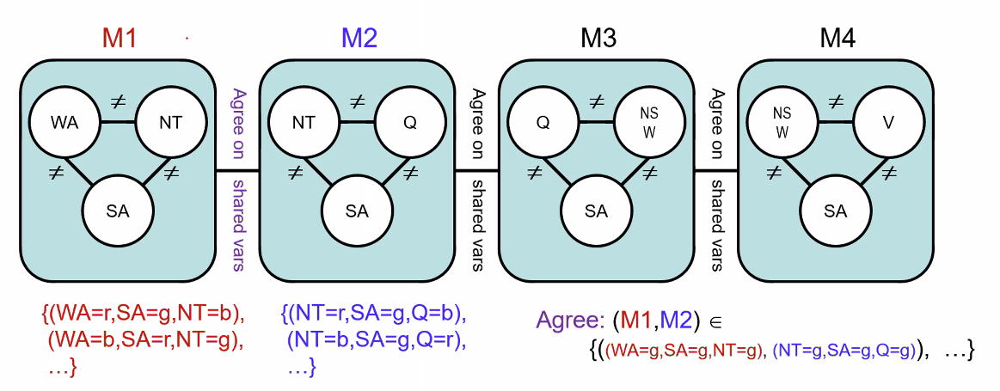

# Lecture #9 Notes - Filtering and Ordering
- Author: Evan Brooks
- Date: Wednesday, September 30th, 2026

## Ordering: minimum remaining values
- Variable ordering: minimum remaining values (MRV)
    - Choose the variable with the fewest legal values left in its in domain
    - Rationale: Fail as soon as possible, so we can backtrack and try a different assignment

## Ordering: least constraining value
- Value ordering: Least constraining value (LCV)
    - given a choice of variable, pick the _least_ constrained value
    - i.e. the one that rules out the fewest values in the _remaining_ variables
    - Rationale: trying to constrain our future states as little as possible with our current selection
    - note that it may take some computation to determine this
- Combining these ordering ideas makes 1000 queens (k = 1000) feasible

## Constraint satisfaction problems II

### Improving backtracking
- General purpose ideas give huge gains in speed
    - ... but it is all still NP-hard
- Filtering: can we detect inevitable failure early?
- Ordering: 
    - Which variable should be assigned next? (MRV)
    - In what order should its values be tried? (LCV)
- Structure: Can we exploit problem structure?

### K-Consistency
- Increasing degrees of consistency
    - 1-Consistency (node consistency): Each single node's domain has a value which meets that node's unary constraints
    - 2-Consistency (arc consistency): For each pair of nodes, any consistent assignment to one can be extended to the other
    - k-Consistency: For each k nodes, any consistent assignment to k-1 

### Strong K-Consistency
- Strong k-consistency: also, k-1, k-2, ... 1 consistent
- Claim: Strong n-consistency means we can solve without _any_ backtracking
- Why?
    - Choose any assignment to any variable
    - Choose a new variable
    - By 2-consistency, there is a choice consistent with the first
    - Choose a new variable
    - By 3-consistency, there is a choice consisten with the first 2
    - ...and so on
    - until you've selected all variables in a "single go"
- There is lots of middle ground between arc consistency and n-consistency (e.g. k=3, called path consistency)

### Problem structure
- Extreme case: independent subproblems
    - Example: Tasmania and mainland do not interact in the map coloring problem
- Independent subproblems are identifiable as connected components of a constraint graph
- Suppose a graph of $n$ variables can be broken into subproblmes of only $c$ variables
    - Worst-case solution cost is $O(n/c*d^c)$, linear in $n$
    - E.g. $n = 80, d = 2, c = 20$ (80 nodes, 2 valid values for each node, subproblems containing 20 nodes)
    - $2^{80} =$ 4 billion years at 10 million nodes/sec
    - $4*2^{20} =$ 0.4 seconds at 10 million nodes/sec

### Tree-structure CSPs

- Theorem: if the constraint graph has no loops, the CSP can be solved in $O(n*d^2)$ time
    - Compare to general time, where worst case is $O(d^n)$

- Algorithm for tree-structured CSPs:
    - Order: Choose a root variable, order variables so that parents precede children

- Remove backward: For i = n : 2, apply RemoveInconsistent(Parent(X_i), X_i) or, in other words, 

### Nearly tree-structured CSPs

- Conditioning: instantiate a variable, prune its neighbors domains
- Cutset conditioning: instantiate (in all ways) a set of variables such that the remaining constraint graph is a tree
- Cutset size $c$ gives runtime $O(d^c*(n-c)*d^2)$, very fast for small $c$

### Tree decomposition
- Idea create a tree-structured graph of mega-variables
- Each mega-variable encodes part of the original CSP
- Subproblems overlap to ensure consistent solutions

